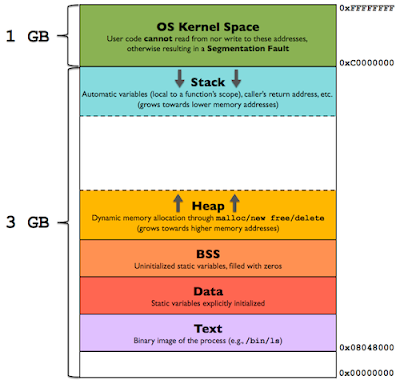

# 常見 C 語言觀念題目總整理

## 一、指標
指標 (pointer)：一個指向某個儲存位址的變數，語法為

```c
int *ptr = &var;
```

其中
* & : 取變數位址
* \* : 表示為指標變數

也可用於函數變為函式指標 (function pointer)，語法為

```c
void (*fptr)(type_a, type_b) = &func;
```

常用的地方如下
* 函式 sort 時傳入判斷準則
* multithread 傳函數進入建立 thread 的 API 中
* callback function (一種事件導向的函式)

### 1. 基礎指標判讀
指標判讀大原則為「從右讀到左」，例如：
```c
int a; // 一個整數型
int *a; // 一個指向整數的指標
int **a; // 一個指向指標的指標，它指向的指標是指向一個整數型
int a[10]; // 一個有10個整數型的陣列
int *a[10]; // 一個有10個指標的陣列，該指標是指向一個整數型的
int (*a)[10]; // 一個指向有10個整數型陣列的指標
int (*a)(int); // 一個指向函數的指標，該函數有一個整數型參數並返回一個整數
int (*a[10])(int); // 一個有10個指標的陣列，該指標指向一個函數，該函數有一個整數型參數並返回一個整數
```

注意宣告兩個指標時不能寫做 int* a, b; 因為前式等價於 int* a; int b;。連續宣告兩個指標用 int *a, *b;

### 2. 指標與其他關鍵字混用

一樣右讀到左，例如：
```c
const int * foo; // 一個 pointer，指向 const int 變數。
int const * foo; // 一個 pointer，指向 const int 變數。
int * const foo; // 一個 const pointer，指向 int 變數。
int const * const foo; // 一個 const pointer，指向 const int 變數。
```
關鍵字 volatile 等等判讀方式相同。

## 二、call by value, call by reference
1. call by value : 最常見的函式寫法，呼叫者和被呼叫者的變數各自佔有記憶體，將參數複製再傳給函式。
2. call by reference : 呼叫者和被呼叫者的變數使用相同的記憶體位址，因此在被呼叫函式中改變變數時，變動結果會保留。(C++ 才有，寫法為 type func(type &var) { ... })

C 語言之父明確表示 C 語言只有 call by value。坊間有 call by address 的說法其實是方便教學，指的是對指標變數進行操作的 call by value，具體的執行效果和 call by reference 一樣。

## 三、變數範圍和生命周期（關鍵字 static）
1. local 變數 : local 變數僅活在該函式內，存放位置在 stack 或 heap 記憶體中。
2. static 變數 : static 變數生命周期 (life time) 跟程式一樣長，而範圍 (scope) 則維持不變，即在宣告的函式之外仍無法存取 static 變數。
3. global 變數 : 所有區段皆可使用此變數。

除了範圍不同，static 變數只有宣告的檔案可以使用；而 global 變數可加上 extern 關鍵字修飾，即可在其他檔案以 .h 標頭檔方式使用該變數 (也就是 internal linkage 和 external linkage 的不同)。

* Stack : 存放函數的參數、區域變數等，由空間配置系統自行產生與回收。(會稱作 stack 是由於其配置遵守 LIFO)
* Heap : 一般由程式設計師分配釋放，執行時才會知道配置大小，如 malloc/new 和 free/delete。(注意其資料結構不是 DS 中的 heap 而是 link-list)
* Global : 包含 BSS (未初始化的靜態變數)、data section (全域變數、靜態變數) 和 text/code (常數字元)。



配置練習
```c
int a=0;                     //global 初始化區
char *p1;                    //global 未初始化區
main(){
    int b;                   // stack
    char s[]="abc";          // stack
    char *p2;                // stack
    char *p3="123456";       // 123456\0 在常量區，p3在stack。
    static int c=0;          // global (static) 初始化區
    p1 = (char*)malloc(10);
    p2 = (char*)malloc(20);  //分配得來得10和20位元組的區域在heap
    strcpy(p1,"123456");  
    //123456\0 在常量區，編譯器可能會將它與 p3 中的 123456\0 優化成一個地方。
}
```

static 練習
```c
static int num_a;
// 專屬於整個檔案的全域變數，其他檔案不能存取

void func (int num_b) { // stack 區 
    int num_c; // stack 區

    static int num_d; 
    //scope不變，只能在函數 func 內呼叫，但 lifetime 是整支程式執行的時間。
}
```

## 四、關鍵字 const
const 通常表示只可讀取不可寫入的變數，常用來宣告常數。使用 const 有以下好處：
* 提升程式碼可讀性
* 使編譯器保護那些不希望被改變的參數
* 給優化器一些附加的資訊

#### const vs #define
1. 編譯器處理方式 : define 在預處理階段展開；const 在編譯階段使用。
2. 類型和安全檢查 : const 會在編譯階段會執行類型檢查，define 則不會。
3. 存儲方式 : define 直接展開不會分配記憶體，const 則會在記憶體中分配。

## 五、關鍵字 volatile
由於嵌入式系統常處理 I/O、中斷、即時操作系統 (RTOS) 相關的問題，因此在嵌入式系統開發中 volatile 尤為重要。被 volatile 修飾的變數代表它可能會被不預期的更新，因此告知編譯器不對它涉及的地方做最佳化，並在每次操作它的時候都讀取該變數實體位址上最新的值，而不是讀取暫存器的值。

volatile 常見的應用：
1. 修飾中斷處理程式中 (ISR) 中可能被修改的全域變數。
2. 修飾多執行緒 (multi-threaded) 的全域變數。
3. 設備的硬體暫存器 (如狀態暫存器)

#### const 和 volatile 合用
```c
extern const volatile unsigned int rt_clock;
```
這是在 RTOS kernel 常見的一種宣告：rt_clock 通常是指系統時鐘，它經常被時鐘中斷進行更新。所以它是 volatile。因此在用的時候，要讓編譯器每次從記憶體裡面取值。而 rt_clock 通常只有一個寫者（時鐘中斷），其他地方對其的使用通常都是唯讀的。所以將其聲明為 const，表示這裏不應該修改這個變數。所以 volatile 和 const 是兩個不矛盾的東西，並且一個物件同時具備這兩種屬性也是有實際意義的

## 六、關鍵字 inline
inline 可以將修飾的函式設為行內函式，即像巨集 (define) 一樣將該函式展開編譯，用來加速執行速度。

inline 和 #define 的差別在於：
1. inline 函數只對參數進行一次計算，避免了部分巨集易產生的錯誤。
2. inline 函數的參數類型被檢查，並進行必要的型態轉換。
3. 巨集定義盡量不使用於複雜的函數
4. 用 inline 後編譯器不一定會實作，僅為建議。

## 七、前處理器相關
前處理器主要處理加入檔案 #include、巨集定義 #define 和 #undef 條件編譯。

1. 巨集 #define
\#define 是巨集，在前置處理器 (preprocessor) 執行時處理，將要替換的程式碼展開做文字替換。define 語法範例如下：
```c
#define PI 3.1415926    //常數巨集
#define A(x) x          //函數巨集
#define MIN(A，B)  ( (A)  <= (B) ? (A) : (B))
```

注意把參數用括號括起來，不然容易發生以下錯誤：
```c
#define SUM(a,b)  a+b
```

當 SUM(2,5)*10 時，因為沒有括弧先乘除後加減，得輸出為 52，錯誤。

2. 引入防護和條件編譯
引入防護 (Include guard) 是一種條件編譯，用於防範 #include 指令重複引入的問題。
```c
/* 避免重複引入 */
#ifndef MYHEADER
#define MYHEADER
...
#endif
```

第一次被引入時會定義巨集 MYHEADER，再次引入時判斷 #ifndef 測試失敗，因此編譯器會直接跳到 #endif，由此避免了重複引用。另有非標準的指令 #pragma once 提供相同效果，但由於可攜性不如上例，因此大多時候還是上面提到的方法為主

條件編譯還有一些其它應用：
```c
/* 若前處理器已經 define MYHEADER，就編譯 part A，否則編譯 part B。 */
#ifdef MYHEADER
#define MYHEADER
   // part A
#else
   // part B
#endif

/* DEBUG flag */
#ifdef DEBUG
   printf("device_open(%p) ", file);
#endif
```

## 八、bitwise operator
邏輯上的運算子在 C 中的語法分別如下：
1. AND （&）
2. OR（|）
3. NOT（!）
4. XOR（^）// bit值不一樣為 1
5. complement（~）
6. shift (<<, >>)

bitwise 的操作常與 "0x" 這種 16 進位表示法，方便轉換操作。

基本運算
```c
unsigned long num_a = 0x00001111;
unsigned long num_b = 0x00000202;
unsigned long num_c;

num_c = num_a & (~num_b);
num_c = num_c | num_b;

printf("%lx", num_c); // 00001313
```

mask 方法做 bitwise 操作
```c
a = a | 7    // 最右側 3 位設為 1，其餘不變。
a = a & (~7) // 最右側 3 位設為 0，其餘不變。
a = a ^ 7    // 最右側 3 位執行 NOT operator，其餘不變。
```

## 九、複製：memcpy 和 strcpy
1. 記憶體複製
```c
void *memcpy( void *dest, const void *src, size_t count );
```
memcpy() 可以複製任何類型資料，不處理字串結束 '\0' 的情況，當 *src 長度大於 *dest 時會 buffer overflow (編譯時不會錯誤)。

2. 字串複製
```c
void *strcpy( void *dest, const void *src);
```

strcpy() 只能用於字串複製，不需要指定長度，因為會自動偵測以 '\0' 為結尾，當 *src 長度大於 *dest 時會 buffer overflow (*dest 將沒有 \0)。

舉例
```c
#include <string.h>
#include <stdio.h>
int main (){
    const char *str1 = "abc\0def";
    char str2[16] = {0};
    char str3[16] = {0};

    strcpy(str2, str1);
    memcpy(str3, str1, sizeof(str3));  // 8
    printf("str2 = %s\n", str2);       // str2 = abc
    printf("str3 = %c\n", str3[5]);    // str3 = e
    return 0;
}
```

## 十、延伸性資料型態：struct、typedef、union 和 enum
1. 結構 struct
struct 是使用者自定的型態，包含數個不同資料型態的變數，將不同的資料型態關聯在一起，使他們的關聯更直覺。

```c
struct [structName] {
    char name[16]; 
    int age;
    struct [structName] *ptr;  
    // 不能含有自己，但可以有自己型別的指標。
};

int main () {
    struct [structName] person1 = {"Amy", 20 }; // 初始化
    person.age = 21; // 操作
}
```

2. 重新定義型態名稱 typedef
typedef 保留字可以為資料型態建立別名，使程式更易閱讀理解。例如：
```c
typedef struct [structName] {
    char name[16];
    int age;
    struct [structName] *ptr;
} PERSON;

int main () {
    PERSON person1 = {"Amy", 20 };
    person1.age = 21;
}
```

3. 列舉 enum
enum 是一種常數定義方式，可以提升可讀性，enum 裡的識別字會以 int 的型態，從指定的值開始遞增排列 (預設為 0)。

```c
typedef enum {SUN=0, MON, TUE, WED, THU, FRI, SAT} week_type;
week_type week = WED;
if(week == WED)
    printf("%d\n", week) // 3
```

4. 共用結構 union
電腦架構早期記憶體空間比較不足，因此需要使用共用結構讓各變數共用一塊記憶體，union 所需的記憶體空間大小由最大的成員變數決定，例如以下 union 的大小為 8 位元組 (upper bound double)。
```c
union data{
    char c;
    int num;
    double fnum;
};
union data a, b;
```

struct 是每個成員變數都配置一段空間，union 則是共用一段記憶體空間。另外，union 需注意記憶體內的排列方式，如 little-endian 方法排列，int 會放在 double 的 byte 3~0 的位置，從而改變 double 讀取時的值。

## [補充] 未定義行為 (Undefined behavior)
常見的語法 i++ 和 ++i 具有以下性質：
* i++ : 先用i，再將i+1
* ++i : 先i+1，再用i

因此會出現這種問題：
```c
int i = 10
i = i++ + ++i;
```

這個問題的標準答案是
```txt
i = i++ + ++i;
i = 10 + ++i;
i = 10 + 12;
i = 22
```

但是這是有爭議的！編譯時會有警告訊息

## Reference
* Mr. Opengate - 常見 C 語言觀念題目總整理（適合考試和面試）: [Link](https://www.mropengate.com/2017/08/cc-c.html)