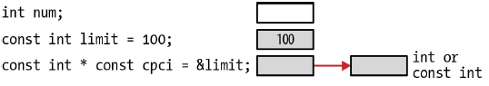

# Chatper 1 - 入門
## 指標與記憶體
### 記憶體類型:
1. 靜態 Static / 全域 Global
2. 自動 Automatic
3. 動態 Dynamic

|變數類型|範圍|生命週期|
|-|-|-|
|全域|整個檔案|應用程式的生命週期|
|靜態|宣告所在的函數|應用程式的生命週期|
|自動 (區域)|宣告所在的函數|函數執行期間|
|動態|視參考到的指標而定|直到釋放記憶體|

※ 指標變數存放的是記憶體位址，並不含任何能夠得知所參照記憶體資料型別所需的資訊

指標的用途:
1. 建立快速有效率的程式碼
2. 提供更方便解決問題的方法
3. 動態記憶體配置
4. 簡化表達式
5. 利用指標傳遞結構資料，避免傳遞大量資料所造成的負擔
6. 保護以參數傳入函數的資料


下述程式皆會印出n

```c
char *names[] = {"Miller","Jones","Anderson"};
printf("%c\n",*(*(names+1)+2));  // 難懂
printf("%c\n",names[1][2]);      // 易懂
```

指標可能引發的問題:
1. 存取陣列或其他資料結構時超出可用範圍
2. 在可用範圍之外參考自動變數
3. 在記憶體釋放後參考配置在堆積上的記憶體
4. 在配置記憶體前解參考指標

### 宣告指標
```c
int num;  // 整數
int *pi;  // 整數指標
```


以下宣告皆相同，空白取決於使用者的喜好

```c
int* pi;
int * pi;
int *pi;
int*pi;
```

※ 雖然指標不需要初始化就能使用，但初始化才能確保有正確行為

```c
const int *pci;
           ---- pci是個變數
          ----- pci是個指標變數
      --------- pci是個指向整數的指標變數
--------------- pci是個指向整數常數的指標變數
<-------------- 由後往前讀宣告 
```

### 位址運算子
位址運算子&會回傳運算元的位址
```c
num = 0;     // num變數的數值設為0
pi = &num;   // pi設定成指向num的位址


int num;
int *pi = &num;  // 也可以在宣告指標時就將pi指派為num的位址


num = 0;
pi = num;   // Error: invalid conversion from 'int' to 'int*'


pi = (int*)num  // 利用轉型將整數指派給整數指標，執行時可能造成程式異常終止，因為程式可能解參考位址0


// 盡早初始化指標是個好習慣
int num;
int *pi;
pi = &num;
```


### 顯示指標值
```c
int num = 0;
int *pi = &num;
printf("Address of num: %d Value: %d\n",&num, num);
printf("Address of pi: %d Value: %d\n",&pi, pi);
```

輸出結果為
```shell
Address of num: 4520836 Value: 0
Address of pi: 4520824 Value: 4520836
```

|格式|意義|
|-|-|
|%x|以16進位數字顯示位數|
|%o|以8進位數字顯示位數|
|%p|以實作指定的方式顯示數值，一般是指16進位|

```c
printf("Address of pi: %d Value: %d\n",&pi, pi);
printf("Address of pi: %x Value: %x\n",&pi, pi);
printf("Address of pi: %o Value: %o\n",&pi, pi);
printf("Address of pi: %p Value: %p\n",&pi, pi);
```

輸出結果為
```shell
Address of pi: 4520824 Value: 4520836
Address of pi: 44fb78 Value: 44fb84
Address of pi: 21175570 Value: 21175604
Address of pi: 0044FB78 Value: 0044FB84
```

%p與%x的差別在於%p會以大寫顯示16進位數值

在不同平台上用相同的方式顯示指標數值並不容易，一個方式是將指標轉型為void的指標，再用%p印出
```c
printf("Value of pi: %p\n", (void*)pi);
```

### 使用間接運算子解參考指標
間接運算子(*)會回傳指標變數只到的記憶體中的數值
```c
int num = 5;
int *pi = &num;
printf("%p\n",*pi);  // 會顯示5
```

解參考後的數值作為lvalue，lvalue能放在指派運算子左側的運算元，因為被指派了新值，所有的lvalue數值都會被改變

```c
*pi = 200;
printf("%d\n",num);  // 會顯示200
```

### 函數指標
指標也可以指向函數
```c
void (*foo)();
```

### NULL的概念
當NULL被指派給指標時表示沒有指向任何東西。NULL的概念表示指標持有一個不會與其他指標相等的特殊數值，沒有指到記憶體中的任何區域。兩個NULL指標總是相等，但兩者可以有各自的指標型別。NULL在許多函式庫中都定義如下:
```c
#define NULL ((void*)0)
```

※ NULL指標與未初始化指標並不相同，未初始化指標可能持有任何數值，有NULL值的指標則不會參照到記憶體的任何位置

有趣的是可以將0值指派給指標，卻無法將其他數值指派給整數

```c
pi = 0;
pi = NULL;
pi = 100;  // 語法錯誤
pi = num;  // 語法錯誤
```

指標可以用在邏輯表達式中唯一的運算元
```c
// 不是NULL
if(pi) {}  // 如果pi被指派為NULL值，就會被解釋為二進位的0值，在C語言中也代表為False
// 是NULL
else {}    
```

```c
int num;
int *pi = 0;  // 0表示NULL指標
pi = &num;
*pi = 0;      // 0表示整數
```

※ 使用NULL可以明確提醒正在處理的變數是指標

### void指標
void指標是個可以指向任何資料型別的通用指標，有以下特性:
1. void指標與char指標有相同的表達方式與記憶體對齊
2. void指標永遠不會和其他指標相等，然而有兩個指派為NULL的void指標則會相等，void指標的實際行為會依系統而有不同

任何指標皆可以指派給void指標，之後還可以轉型回來原來的指標，轉型後的值會等於原來的指標值
```c
int num;
int *pi = &num;
printf("Value of pi: %p\n", pi);
void* pv = pi;
pi = (int*) pv;
printf("Value of pi: %p\n", pi);
```

輸出結果為
```shell
Value of pi: 100
Value of pi: 100
```

※ 使用void指標時要注意，將指標轉型為void指標後，void指標能夠轉型為任何指標型別，沒有任何限制。

sizeof運算子能夠用在void指標，卻不能用在void之上
```c
size_t size = sizeof(void*);  // 合法
size_t size = sizeof(void);   // 不合法
```

### 全域與靜態指標
```c
int *globalpi;
void foo() {
    static int *staticpi;
    ...
}

int main() {
    ...
}
```


### 指標大小與陣列
處理指標時常需要使用四種內建指標型別
1. `size_t` : 表示空間大小使用的安全型別
2. `ptrdiff_t` : 指標運算使用
3. `intptr_t`與`uintptr_t` : 用來存放指標位址

### 認識size_t
size_t型別表示C語言中所有物件的最大尺寸，也是sizeof回傳的型別

※ 宣告字元數量與陣列索引變數時，使用size_t是好習慣，在迴圈計數、陣列索引以及某些指標運算時都應該使用這個型別

在`stdio.h`與`stdlib.h`中的定義
```c
#ifndef __SIZE_T
#define __SIZE_T
typedef unsigned int size_t;  // 通常size_t的最大值定義為SIZE_MAX
#endif
```

列印size_t時要注意，這個是無號數。建議用`%zu`，在不支援此格式時，可以用`%u`或`%lu`

```c
size_t sizet = -5;
printf("%d\n",sizet);   // 印出 5
printf("%zu\n",sizet);  // 印出 4294967291

// 由於-5是有號數，最高位原為1表示負值，
// 當以無號數來解讀時，最高位元會視為2的次方，因此使用%zu會看到很大的數值

sizet = 5;
printf("%d\n",sizet);   // 印出 5
printf("%zu\n",sizet);  // 印出 5
```

※ size_t是無號數，切記使用正數

### 使用sizeof與指標
sizeof運算子可以取得指標的大小
```c
printf("Size of *char: %d\n",sizeof(char*));
```

輸出結果為
```shell
Size of *char: 4
```

### 使用intptr_t與uintptr_t
intptr_t與uintptr_t型別用於儲存指標位址，會與系統使用的底層指標有相同的大小，uintptr_t為intptr_t的無號版本，uintptr_t的彈性不如intptr_t

```c
int num;
intptr_t *pi = &num;
uintptr_t *pu = &num;  // error: invalid conversion from 'int*' to
                       // 'uintptr_t* {aka unsigned int*}' [-fpermissive]

// uintptr_t與其他型別一同使用時都需要強制轉型 
char c;
uintptr_t *pc = (uintptr_t*)&c;
```

※ 避免將指標轉型成整數，在64位元指標的情況下，如果整數大小是4位元將會遺失大部分資訊

### 指標運算子
|運算子|名稱|意義|
|-|-|-|
|*||用於宣告指標|
|*|解參考|用於解參考指標|
|->|指向|用於取得指標參考到的結構中的成員|
|+|加法|用於遞增指標|
|-|減法|用於遞減指標|
|==, !=|相等，不相等|比較兩個指標|
|>, >=, <, <=|大於，大於等於，小於，小於等於|比較兩個指標|
|(資料型別)|強制轉型|改變指標的類型|

有幾個數學運算子可以操作資料指標，如:
1. 指標加上整數
2. 指標減掉整數
3. 兩個指標相減
4. 比較指標

這些運算並非總是能夠用於函數指標

### 指標與整數相加
這個運算很常見也很有用，當指標加上整數，實際加上的是整數乘上指標資料型別的位元數

|資料型別|位元組數|
|-|-|
|byte|1|
|char|1|
|short|2|
|int|4|
|long|8|
|float|4|
|double|8|

```c
int vector[] = {28, 41, 7};
int *pi = vector;      // pi: 100
printf("%d\n",*pi);    // 顯示28
pi += 1;               // pi: 104
printf("%d\n",*pi);    // 顯示41
pi += 1;               // pi: 108
printf("%d\n",*pi);    // 顯示7

// pi指標指向了自己，存取陣列邊界之外的記憶體是十分危險的事情，要盡力便免
pi = vector;
pi += 3;
```


※ 只使用陣列名稱時，會回傳陣列的位址，也就是陣列中第一個元素的位址

以下程式示範對short與char資料型別指標做加法運算
```c
short s;
short *ps = &s;
char c;
char *pc = &c;

printf("Content of ps before: %d\n",ps);
ps = ps + 1;
printf("Content of ps after: %d\n",ps);
printf("Content of pc before: %d\n",pc);
pc = pc + 1;
printf("Content of pc after: %d\n",pc);
```

輸出結果為:
```shell
Content of ps before: 120
Content of ps after: 122
Content of pc before: 128
Address of pc after: 129
```

### void指標與加法
大多數編譯氣都允許對void指標進行數學運算作為擴充功能。以下假設void指標的大小為4，在void指標加一可能造成語法警告。

```c
int num = 5;
void *pv = &num;
printf("%p\n",pv);
pv = pv+1;  // 語法警告，warning: pointer of type 'void *' used in arithmetic [-Wpointerarith]
```

這不是標準C語言功能，編譯器會產生警告

### 指標減掉整數
指標減掉整數的行為類似指標加法，減掉整數值乘上資料型別的大小

```c
int vector[] = {28, 41, 7};
int *pi = vector + 2;    // pi: 108
printf("%d\n",*pi);      // 顯示7
pi--;                    // pi: 104
printf("%d\n",*pi);      // 顯示41
pi--;                    // pi: 100
printf("%d\n",*pi);      // 顯示28
```


### 指標相減
兩指標相減會得到位址間的差，位址差除了判斷元素在陣列中的順序之外，並不太有用。兩個指標的差是「單位」的差異數。

```c
int vector[] = {28, 41, 7};
int *p0 = vector;
int *p1 = vector+1;
int *p2 = vector+2;
printf("p2-p0: %d\n",p2-p0); // p2-p0: 2
printf("p2-p1: %d\n",p2-p1); // p2-p1: 1
printf("p0-p1: %d\n",p0-p1); // p0-p1: -1
```


不要將指標相減與解參考後的數值相減混淆
```c
printf("*p0-*p1: %d\n",*p0-*p1); // *p0-*p1: -13
```

### 比較指標
指標可以透過標準的比較運算子比較，一般而言，比較指標並沒有太大的用處，當比較的指標址像陣列的元素，能夠用結果判斷元素在陣列中的順序。
```c
int vector[] = {28, 41, 7};
int *p0 = vector;
int *p1 = vector+1;
int *p2 = vector+2;
printf("p2>p0: %d\n",p2>p0); // p2>p0: 1 (true)
printf("p2<p0: %d\n",p2<p0); // p2<p0: 0 (false)
printf("p0>p1: %d\n",p0>p1); // p0>p1: 0 (false)
```

### 多層級間皆操作
指標能夠提供多層級的間接操作，經常可以看到變數宣告為指標的指標，有時候稱為雙重指標 (double pointer)。

以下的例子使用三個陣列:
```c
// 第一個陣列是個用來存放書籍名稱的清單的陣列
char *titles[] = {"A Tale of Two Cities", 
    "Wuthering Heights","Don Quixote",
    "Odyssey","Moby-Dick","Hamlet",
    "Gulliver's Travels"
};

// 另外兩個陣列的目的分別為維護最好的書籍以及英文書
char **bestBooks[3];
char **englishBooks[4];


// 兩陣列初始化如下
// 等號右邊的數值計算事先依據索引值取得元素，再透過取址運算子取得位址
bestBooks[0] = &titles[0];
bestBooks[1] = &titles[3];
bestBooks[2] = &titles[5];
englishBooks[0] = &titles[0];
englishBooks[1] = &titles[1];
englishBooks[2] = &titles[5];
englishBooks[3] = &titles[6];

printf("%s\n",*englishBooks[1]); // Wuthering Heights
```

記憶體配置如下圖:


多層級間接操作在程式的撰寫與使用上提供額外的彈性，間接的層級並沒有任何預設限制，但太多層級的間接操作會造成困擾並提高維護的困難。

### 常數與指標
將const關鍵字結合址標示C語言中強而有力且內容豐富的主題，能為不同類型的問題提供額外的保護，其中特別重要且有用的就是指向常數的指標。

指標能夠定義為指向某個常數，表示無法用指標修改參考到的數值內容
```c
int num = 5;
const int limit = 500;
int *pi;          // 指向整數的指標
const int *pci;   // 指向整數常數的指標
pi = &num;
pci = &limit;
```


將各變數的位址與數值印出來:
```c
printf(" num - Address: %p value: %d\n",&num, num);
printf("limit - Address: %p value: %d\n",&limit, limit);
printf(" pi - Address: %p value: %p\n",&pi, pi);
printf(" pci - Address: %p value: %p\n",&pci, pci);
```

輸出結果為:
```shell
num - Address: 100 value: 5
limit - Address: 104 value: 500
pi - Address: 108 value: 100
pci - Address: 112 value: 104
```

如果只是讀取參考位址的數值，那解參考常數指標並不會造成任何問題:
```c
printf("%d\n", *pci);
```

程式無法透過解參考常數指標的方式修改參考的數值內容，只能修改指標指到的位址。指標值並不是常數，可以修改指標指向其他整數常數或是一般的整數，修改指標不會有任何問題。

這表示以下程式是合法的:
```c
// 可以解參考pci讀取變數內容，卻無法透過解參考修改數值
pci = &num;
```

以下程式會造成錯誤:
```c
*pci = 200;  // 'pci' : you cannot assign to a variable that is const
```

指標認為指到的變數是整數常數，不允許透過指標修改內容，但仍可以透過num修改內容，只是無法透過pci進行修改。


pci宣告為指向整數常數的指標代表:
1. pci可以指派為指向其他整數常數
2. pci可以指派為指向其他非常數整數
3. pci可以透過解參考讀取數值
4. pci無法透過解參考改變指向的位址內容

※ 宣告中const與資料型別的順序並不重要，以下兩種形式的宣告有相同效果:
```c
const int *pci;
int const *pci;
```

### 指向不是常數的指標常數
也可以將指標常數 (constant pointer) 宣告為指向非常數，這樣的宣告方式表示雖然指標無法改變，但指向的資料值可以改變
```c
int num;
int *const cpi = &num;
```

這樣的宣告表示:
1. cpi必須初始為指向不是常數的變數
2. cpi指標無法修改
3. cpi指到的資料可以修改

這種類型的指標概念可以視為:


可以解參考cpi設定指到的資料為新值，以下兩個都是合法的指派命令:
```c
*cpi = limit;
*cpi = 25;
```

然而，如果試著將cpi初始化為另一個常數limit，會得到警告
```c
const int limit = 500;
int *const cpi = &limit;

// warning: initialization discards qualifiers from pointer target type
```

如果cpi參照到常數limit，就能夠透過cpi修改常數內容，但這不會是程式預期的行為，通常會讓常數維持常數狀態。

將cpi指派到特定的位址後，就無法為cpi指派新值:
```c
int num;
int age;
int *const cpi = &num;
cpi = &age;

// 'cpi' : you cannot assign to a variable that is const
```

### 常數指標常數
常數指標常數視個較少使用的指標型別，指標本身無法修改而且指向的資料也無法透過指標修改
```c
const int * const cpci = &limit;
```



如同常數指標，指派給cpci的病不需要是常數位址，可以如下使用num:
```c
int num;
const int * const cpci = &num;
```

指標宣告時就必須初始化，沒有初始化的程式會產生語法錯誤:
```c
const int * const cpci;

// 'cpci' : const object must be initialized if not extern
```

對於常數指標常數，無法進行以下操作:
1. 修改指標
2. 修改指標指到的資料內容

```c
// 試著將cpci指派新的位址會產生錯誤訊息
cpci = &num;

// 'cpci' : you cannot assign to a variable that is const


// 如果解參考指標指派新值，也會產生語法錯誤
*cpci = 25;

// 'cpci' : you cannot assign to a variable that is const expression must be a modifiable lvalue
```

## 指向「常數指標常數」的指標
常數指標也可以做多層級的間接操作:
```c
const int * const cpci = &limit;
const int * const * pcpci;
```


使用方式如下，程式會輸出兩次500
```c
printf("%d\n",*cpci);
pcpci = &cpci;
printf("%d\n",**pcpci);
```

|指標類型|指標是否可修改|參照的資料是否能修改|
|-|-|-|
|非常數指標|✓|✓|
|常數指標|✓|✕|
|非常數指標常數|✕|✓|
|常數指標常數|✕|✕|
