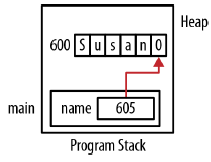

# Chatper 2 - C語言的動態記憶體管理
### 動態記憶體配置
C語言中動態記憶體配置的基本程序如下:
1. 使用malloc等函數配置記憶體
2. 依應用程式需要使用所配置的記憶體
3. 使用free函數釋放記憶體

```c
int *pi = (int*) malloc(sizeof(int));
*pi = 5;
printf("*pi: %d\n", *pi);
free(pi);
```


malloc函數只有一個指定需要配置記憶體數量的參數，配置成功會回傳在堆積中配置的記憶體位址，失敗則傳回NULL指標。sizeof運算子能提高程式可攜性，正確計算出需要配置的位元組數量。

以下試著配置足夠存放一個整數的記憶體，假設整數大小為4:
```c
int *pi = (int*) malloc(4);
```

由於整數的大小依據使用的記憶體模型而異，教友可攜性的做法是使用sizeof運算子，在任何環境都會傳回正確的大小。

※ 以下是解參考運算子常見的使用錯誤:
```c
int *pi;
*pi = (int*) malloc(sizeof(int));
```
問題出在指派運算子的左側解參考了指標，這會將malloc傳回的位址指派給pi參照的記憶體，如果這是指標的第一次指派，那指標所參照到的記憶體可能不是合法記憶體，正確的用法是:
```c
pi = (int*) malloc(sizeof(int));
```
這種情況並不需要使用解參考運算子。

※ 每個malloc函數 (或其他類似函數)呼叫不再需要配置的記憶體時，就要有對應的free函數呼叫，釋放配置的記憶體以避免記憶體洩漏。

### 記憶體洩漏
記憶體洩漏發生於配置的記憶體已不再使用卻也沒釋放的情況，可能原因為:
1. 遺失記憶體位址
2. 應該呼叫卻沒有呼叫free函數 (這有時稱為隱藏的洩漏)

記憶體洩漏的問題在於無法回收記憶體供後續使用，以下程式碼chunk變數被指派了配置在堆積的記憶體，然而在配置下一塊記憶體前並沒有釋放記憶體，最後應用程式會因為用完記憶體而不正常終止
```c
char *chunk;
while (1) {
    chunk = (char*) malloc(1000000);
    printf("Allocating\n");
}
```

### 遺失記憶體位址
下列程式碼，當pi再次被指派新的位址時會遺失記憶體位址，當第二次pi指派了位址時，就遺失了第一次配置的位址:
```c
int *pi = (int*) malloc(sizeof(int));
*pi = 5;
...
pi = (int*) malloc(sizeof(int));
```

位址500的記憶體沒有被釋放，而程式也不再持有這個位址的參考。


接下來的例子為字串配置了記憶體並初始化，再逐一字元顯示:
```c
char *name = (char*)malloc(strlen("Susan")+1);
strcpy(name,"Susan");
while(*name != 0) {
    printf("%c",*name);
    name++;
}
```

雖然在迴圈中逐次增加了name的值，最後name還是指向字串的NULL終止字元，但遺失了配置給字串使用的起始位址。



### 動態記憶體配置函數
以下介紹函數可以在大多數系統的`stdlib.h`標頭檔中找到:
* malloc
* realloc
* calloc
* free

|函數|說明|
|-|-|
|malloc|從堆積配置記憶體|
|realloc|根據之前配置的記憶體區塊重新配置不同大小的記憶體|
|calloc|從堆積配置記憶體並填入0|
|free|將記憶體區塊歸還至堆積|

動態記憶體是從堆積開始配置，記憶體配置呼叫成功並不保證配置記憶體的順序連續性，但所配置的記憶體會根據指標的資料型別對齊。

### 使用malloc
malloc函數是從堆積配置記憶體區塊，唯一的參數是指定配置的位元組數量，傳回值是void型別指標，如鬼沒有足夠的記憶體則傳回NULL，函數原型如下:
```c
void* malloc(size_t);
```

以下是malloc常見的使用方式:
```c
int *pi = (int*) malloc(sizeof(int));
```

malloc函數執行時會做以下三件事:
1. 從堆積配置一塊記憶體
2. 記憶體內容不會特別修改或清除
3. 傳回第一個位元組的位址

※ 由於malloc函數無法配置記憶體時可能會傳回NULL值，比較好的做法是在使用指標前先檢查是否為NULL值:
```c
int *pi = (int*) malloc(sizeof(int));
if(pi != NULL) {
    // Pointer should be good
} else {
    // Bad pointer
}
```

### 轉型或不轉型
在C語言引進void指標前，需要明確的將malloc傳回值轉型成使用的資料型別，否則會產生不相容資料型別指派的警告訊息。由於void指標能夠指派給其他類型指標，便不再需要明確的轉型，但某些開發人員認為明確的轉型是比較好的做法，原因如下:
1. 能夠記錄,alloc函數的目的
2. 能讓程式碼相容於C++ (以及早期的C編譯器)，這些都需要明確的轉型

### 未配置記憶體
如果宣告指標卻沒有在使用前先配置記憶體，那指標指向的記憶體內容會是垃圾，通常會造成不合法的記憶體參照，例如以下程式碼:
```c
int *pi;
...
printf("%d\n",*pi);
```


### malloc函數的參數大小錯誤
malloc函數配置記憶體大小時透過參數指定，當使用這個函數配置正確數量的位元組數時需要特別小心。例如，需要配置10個double的空間，就需要配置80個位元組:
```c
double *pd = (double*)malloc(NUMBER_OF_DOUBLES * sizeof(double));
```

※ 指定配置的位元組數量時，盡量使用sizeof運算子為佳

### malloc搭配靜態與全域指標
初始化靜態或全域變數時不能使用函數呼叫，以下程式碼宣告了靜態變數，並試著用malloc初始化:
```c
static int *pi = malloc(sizeof(int));  // 會產生編譯錯誤訊息，全域變數也是一樣
```

靜態變數可以將宣告與初始化分離成兩個步驟以避免這種問題，然而全域變數的宣告未於函數與執行程式之外，無法使用類似的作法，因為指派命令必須位於函數之中:
```c
static int *pi;
pi = malloc(sizeof(int));
```

※ 以編譯器的觀點而言，使用初始化運算子`=`與指派運算子`=`並不相同

### 使用calloc函數
calloc函數會同時配置並清除記憶體，原型如下:
```c
void *calloc(size_t numElements, size_t elementSize);
```

※ 清除記憶體表示將記憶體填入2進位的0值

這個函數會配置numElements與elementSize乘積數量的記憶體，傳回指向記憶體第一個位元組的指標: 如果函數無法配置記憶體則傳回NULL指標。如果numElements或elementSize其中一個是0值，會傳回NULL指標，如果calloc無法配置記憶體，也會傳回NULL指標，並將全域變數errno設為EMOMEM (記憶體不足，out of memory)，這是個POSIX錯誤碼，並非支持所有系統。

以下範例pi配置20個位元組，記憶體內容都設為0:
```c
int *pi = calloc(5,sizeof(int));
```

如果不用calloc，也可以使用malloc搭配memset函數達到相同的效果:
```c
int *pi = malloc(5 * sizeof(int));
memset(pi, 0, 5 * sizeof(int));
```

※ memset函數會將整個記憶體區塊填入相同值，第一個參數是指向要填滿的記憶體區塊的指標，第二個參數是填入區塊的數值，最後一個是參數則是需要填滿的位元數。

需要清空記憶體可以使用calloc，但calloc的執行速度比malloc慢。

※ 現在不再需要使用cfree函數。在早期的C語言，這個函數用來釋放由calloc配置的記憶體。

### 使用realloc函數
程式執行一段時間之後，可能會需要改變之前配置給指標的記憶體區塊大小，這對於可變動長度的陣列來說特別有用。函數原型如下:
```c
void *realloc(void *ptr, size_t size);
```

realloc函數傳回第一個指向記憶體區塊的指標，函數需要兩個參數，第一個參數是原先的區塊，第二個參數是新的區塊大小。新的區塊大小會與第一個參數指向的記憶體區塊大小不同，傳回值是個指向重新配置過記憶體區塊的指標。

|第一個參數|第二個參數|行為|
|-|-|-|
|NULL|NA|與malloc相同|
|非NULL|0|釋放原始記憶體區塊|
|非NULL|比原先區塊小|在原先區塊中配置較小的區塊，多餘的釋放回堆積|
|非NULL|比原先區塊大|在原先區塊或堆積中其他位置配置一個更大的區塊|

```c
char *string1;
char *string2;

// 一開始配置16個位元組
string1 = (char*) malloc(16);

// 但只用了13個位元組
strcpy(string1, "0123456789AB");

// 使用realloc函數指定了較小的區塊大小
string2 = realloc(string1, 8);
printf("string1 Value: %p [%s]\n", string1, string1);
printf("string2 Value: %p [%s]\n", string2, string2);
```

輸出結果:
```shell
string1 Value: 0x500 [0123456789AB]
string2 Value: 0x500 [0123456789AB]  # 在原先記憶體位置做修改
```


接下來程式利用realloc配置更多空間:
```c
string1 = (char*) malloc(16);
strcpy(string1, "0123456789AB");
string2 = realloc(string1, 64);
printf("string1 Value: %p [%s]\n", string1, string1);
printf("string2 Value: %p [%s]\n", string2, string2);
```

輸出結果:
```shell
string1 Value: 0x500 [0123456789AB]
string2 Value: 0x600 [0123456789AB]  # 配置額外的記憶體
```


### 利用free函數釋放記憶體
有了動態記憶體配置，程式設計師不需要記憶體後可以將其釋放，供其他人使用，通常利用free函數達成，原型如下:
```c
void free(void *ptr);
```

指標參數是由malloc等函數配置的記憶體位址，記憶體將會歸還到堆積，指標仍然會指向該區塊。
```c
// pi配置了記憶體
int *pi = (int*) malloc(sizeof(int));
...

// 釋放記憶體
free(pi);
```


如果將NULL指標傳入free函數，通常不會做任何事，如果傳入的指標並非由malloc等函數配置，函數行為是為定義。

```c
int num;
int *pi = &num;
free(pi);  // 未定義行為
```

※ 在相同的層級維護記憶體的配置與釋放，例如，如果某個指標是在函數中配置，就在相同函數中釋放。

### 指定被釋放的指標為NULL
指標被釋放之後仍然可能造成問題，如果嘗試解參考被釋放的指標，會產生為定義行為，因此，某些程式設計師會在釋放記憶體後將指標設為NULL，明確地表示指標已經不再合法，之後再使用到這個指標就會造成執行期例外。
```c
int *pi = (int*) malloc(sizeof(int));
...
free(pi);
pi = NULL;
```


這個技巧用來處理懸置指標。

### 重複釋放
重複釋放是指對同一個記憶體區塊執行兩次free，例如以下程式:
```c
int *pi = (int*) malloc(sizeof(int));
*pi = 5;
free(pi);
...
free(pi);  // 第二次free函數執行時會發生執行期例外
```

較不明顯的例子是使用了兩個指標指向相同的記憶體區塊，例如以下程式，若恰巧對相同記憶體釋放兩次，就會產生相同的執行期例外:
```c
p1 = (int*) malloc(sizeof(int));
int *p2 = p1;
free(p1);
...
free(p2);
```


※ 當兩個指標指向相同區塊時，一般稱為別名 (alias)

### 懸置指標
如果釋放記憶體之後，指標仍然指向原來的位置，就稱為懸置指標，這樣的指標指向不該使用的位置，有時也稱為過早釋放。

懸置指標可能造成許多問題:
1. 存取指標指向的記憶體會造成無法預期的行為
2. 當記憶體已無法存取時會造成區段錯誤 (segment fault)
3. 造成安全風險

這些問題的原因是:
* 存取已經被釋放的記憶體
* 傳回的指標是之前函數呼叫中的自動變數指標

以下是簡單懸置指標的範例:
```c
int *pi = (int*) malloc(sizeof(int));
*pi = 5;
printf("*pi: %d\n", *pi);
free(pi);
*pi = 10;  // 懸置指標
```


另一個較不容易發現的情況是有多個指標指向同一個記憶體區域，而其中一個被釋放了:
```c
int *p1 = (int*) malloc(sizeof(int));
*p1 = 5;
...
int *p2;
p2 = p1;
...
free(p1);
...
*p2 = 10;  // 懸置指標
```


使用區塊命令時更難發現問題，如下列程式:
```c
int *pi;
...
{
    int tmp = 5;
    pi = &tmp;
}
// pi現在是個懸置指標
foo();
```

tmp變數是位於堆疊框架上，當離開區塊時就會從堆疊中移除，pi指標現在指向的記憶體位置可能之後被作用中的紀錄覆蓋，例如foo函數。


### 處理懸置指標
由指標引起的錯誤很難在短時間內找出問題，以下是處理懸置指標的常用做法:
1. 將釋放後的指標設為NULL，之後用到這個指標就會讓應用程式終止
2. 撰寫特殊的函數取代free函數
3. 某些系統 (執行期或除錯)能夠在釋放濟體時複寫資料
4. 使用第三方工具偵測懸置指標或其他問題

### C語言的垃圾收集
記憶體不再需要之後，會被收集起來供程式後續執行使用，被釋放的記憶體則被視為垃圾，因此，垃圾收集 (garbage collection)就是指處理這些記憶體的過程。

垃圾收集有以下好處:
1. 程式設計師不需要考慮釋放記憶體的時間
2. 讓程式設計師集中精神在應用程式所要解決的問題上