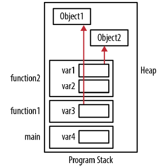
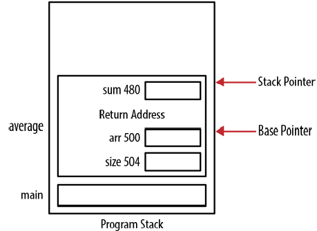
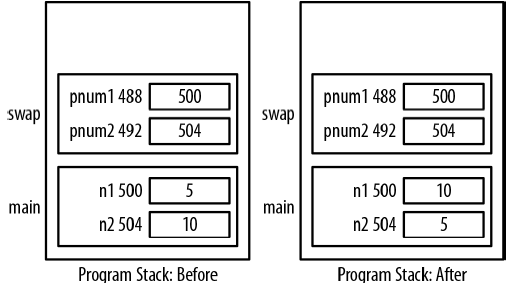
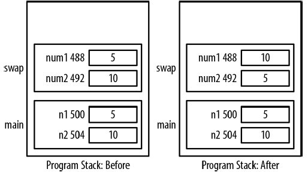
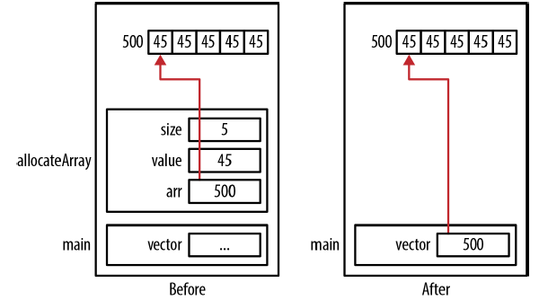
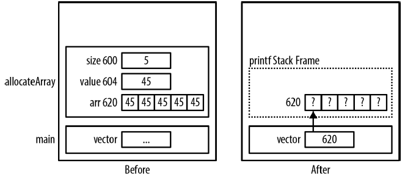
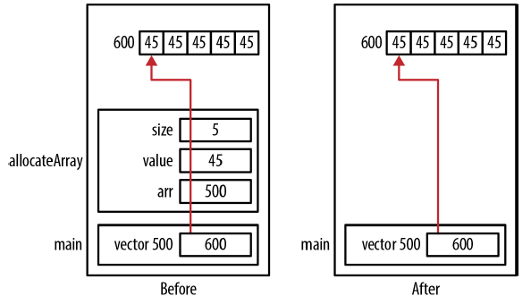
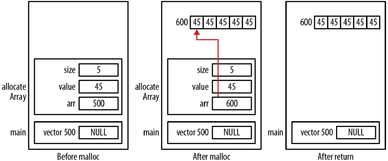

## Chatper 3 - 指標與函數
### 程式堆疊
程式堆疊是支援函數執行的記憶體區塊，通常與堆積共用，有就是兩者共享相同的記憶體區域。一般而言程式堆疊占用下半區域，堆積則使用上半部區域。

```c
void function2() {
    Object *var1 = ...;
    int var2;
    printf("Program Stack Example\n");
}
void function1() {
    Object *var3 = ...;
    function2();
}
int main() {
    int var4;
    function1();
}
```



函數被呼叫時，會建立對應的堆疊框架讓堆疊「向上」成長，函數結束時，堆疊框架會從程式堆疊移除，堆疊框架使用的記憶體不會被清除，而是稍後其他堆疊框架推入程式堆疊時被覆蓋。而動態配置記憶體時會配置在堆積中，讓堆積「向下」成長。

### 堆疊框架的結構
堆疊框架是由幾個部分組成，包含:
* 回傳位址
    - 當函數結束時程是應該恢復的執行位址
* 區域資料儲存空間
    - 配置給區域資料的記憶體
* 參數儲存空間
    - 配置給區域參數的記憶體
* 堆疊與基底指標
    - 執行期系統用於維護堆疊的指標

```c
float average(int *arr, int size) {
    int sum;
    printf("arr: %p\n",&arr);
    printf("size: %p\n",&size);
    printf("sum: %p\n",&sum);
    for(int i=0; i<size; i++) {
        sum += arr[i];
    }
    return (sum * 1.0f) / size;
}
```

輸出結果:
```shell
arr: 0x500
size: 0x504
sum: 0x480
```

建立堆疊框架後，參數會以宣告的相反順序推入堆疊框架，接著是區域變數，全部都依照宣告的相反順序推入。當堆疊框架被推入程式堆疊時，系統可能因為用完所有的記憶體，這個狀況稱為堆疊溢位 (stack overflow)。



### 用指標傳遞資料
用指標傳遞資料的主要目的就是讓函數有修改資料的能力，以下程式實作交換函數
```c
void swapWithPointers(int* pnum1, int* pnum2) {
    // pnum1與pnum2指標在交換過程中進行解參考，這會改變n1與n2的數值
    int tmp;
    tmp = *pnum1;
    *pnum1 = *pnum2;
    *pnum2 = tmp;
}

int main() {
    int n1 = 5;
    int n2 = 10;
    swapWithPointers(&n1, &n2);
    return 0;
}
```



### 用數值傳遞資料
如果沒有將數值以指標的方式傳遞，那就不會發生交換的動作:
```c
// 兩個整數是以數值的方式傳入函數而非以指標傳入，num1與num2兩個參數的數值只是副本
void swap(int num1, int num2) {
    int tmp;
    tmp = num1;
    num1 = num2;
    num2 = tmp;
}

int main() {
    int n1 = 5;
    int n2 = 10;
    swap(n1, n2);
    return 0;
}
```



### 傳入常數指標
傳入常數指標是C語言中常用的技巧，有很高的效率，因為實際傳遞的只是資料的指標，可以避免複製記憶體中大量的資料，但一般的指標能夠修改資料，如果不希望資料被修改，那傳入的指標就該指向常數資料。

```c
void passingAddressOfConstants(const int* num1, int* num2) {
    // 在函數內部，無法修改以整數常數指標方式傳入的資料
    *num2 = *num1;
}

int main() {
    const int limit = 100;
    int result = 5;
    passingAddressOfConstants(&limit, &result);
    return 0;
}
```

若將100指派給result:
```c
void passingAddressOfConstants(const int* num1, int* num2) {
    *num1 = 100;  // 語法錯誤，修改被作為常數參考到的第一參數
    *num2 = 200;
}

int main() {
    const int limit = 100;
    int result = 5;
    passingAddressOfConstants(&limit, &limit);  // 語法錯誤，第二個參數型別與實際傳入的型別不符合
    return 0;
}
```

以下傳入整數數字的位址也會產生語法錯誤:
```c
// 錯誤訊息說明需要以lvalue做為取址運算子的運算元
passingAddressOfConstants(&23, &23);
```

### 傳回指標
傳回指標很容易，只要將傳回值宣告作為指向適當資料型別的指標就行了，以下是兩個常用的技巧:
* 在函數中使用malloc配置記憶體，再傳回位址。呼叫函數的程式負責釋放傳回的指標。
* 將物件傳入函數供內部修改，呼叫函數的程式負責配置與釋放物件所需的記憶體。

首先示範使用malloc函數配置傳回的記憶體:
```c
int* allocateArray(int size, int value) {
    int* arr = (int*)malloc(size * sizeof(int));
    for(int i=0; i<size; i++) {
        arr[i] = value;
    }
    return arr;
}
```

函數使用如下:
```c
int* vector = allocateArray(5,45);
for(int i=0; i<5; i++) {
    printf("%d\n", vector[i]);
}
```



「之前」圖顯示return命令之前的情況，「之後」圖呈現函數回傳後程式的狀態，vector變數現在持有函數中配置的記憶體位址，雖然arr陣列已經在函數結束後清除，但指標參考到的位址並沒有清除，這塊記憶體作中需要被釋放。

雖然上述範例能夠正確執行，但從函數傳回指標時可能發生許多問題:
1. 傳回未初始化的指標
2. 傳回指向不合法位址的指標
3. 傳回指向區域變數的指標
4. 傳回的指標沒有被適當的釋放

allocateArray函數很可能發生最後一個問題。從函數中傳回動態配置記憶體表示呼叫函數的城市需要負責釋放記憶體:
```c
int* vector = allocateArray(5,45);
...
free(vector);
```

不需要傳回資料時必須釋放記憶體，沒有釋放記憶體會造成記憶體洩漏。

### 區域資料的指標
傳回指向區域變數的指標是不了解程式堆疊運作方式的程式設計師常犯的錯誤，例如以下範例:
```c
int* allocateArray(int size, int value) {
    int arr[size];
    for(int i=0; i<size; i++) {
        arr[i] = value;
    }
    return arr;  // 傳回區域變數未址而非動態配置記憶體
}
```

不幸的是，傳回的陣列在函數結束時就不再合法，函數堆疊框架已經從堆疊中移除，但只要呼叫了其他函數就會覆蓋這些數值:
```c
int* vector = allocateArray(5,45);
for(int i=0; i<5; i++) {
    printf("%d\n", vector[i]);
}
```



另一個方式是將arr變數宣告為靜態變數，雖變數的可視範圍侷限在函數當中，但資料內容配置在堆疊框架之外，避免了其他函數覆蓋變數內容的問題:
```c
int* allocateArray(int size, int value) {
    static int arr[5];
    ...
}
```

每次呼叫allocateArray函數都會重複使用相同的陣列，清除前次呼叫建立的陣列內容。除此之外，靜態陣列必須宣告為固定大小，會限制了函數處理不同陣列大小的能力。

### 傳入NULL指標
當函數接受指標作為參數值，在使用前先檢查是否為NULL指標是個好習慣
```c
int* allocateArray(int *arr, int size, int value) {
    if(arr != NULL) {
        for(int i=0; i<size; i++) {
            arr[i] = value;
        }
    }
    return arr;
}
```

如果指標NULL，不會進行任何動作，程式可以繼續執行不會發生不正常終止。

### 傳入指標的指標
當指標做完參數傳入函數時，是以傳值的方式傳入，如果想要修改原來的指標內容而非指標複本，就必須傳入指標的指標。

在下述的範例中，傳入指向整數陣列的指標，在函數內部初始化，函數透過第一個參數傳回配置的記憶體。函數先配置記憶體再初始化，配置的記憶體位址會指派給指向整數的指標。為了修改由外部傳入的指標，必須傳入指標的位址，因此第一個參數宣告為指向整數指標的指標，呼叫函數時則須傳入指標的位址。
```c
void allocateArray(int **arr, int size, int value) {
    *arr = (int*)malloc(size * sizeof(int));
    if(*arr != NULL) {
        for(int i=0; i<size; i++) {
            *(*arr+i) = value;
        }
    }
}
```

測試函數如下:
```c
int *vector = NULL;
allocateArray(&vector,5,45);
```

allocateArray的第一個參數是以指向整數指標的指標方式傳入，當呼叫函數時，需要傳入相同型別，範例中傳入vector的位址。由malloc傳回的位址指派給arr變數，解參考指向指數指標的指標會得到整數指標，也就是vector的位址，因此會修改vector的數值。

※ 劃出記憶體配置圖是找出記憶體洩漏問題最簡單的方法



以下程式說明為何傳入指標無法產生預期的結果:
```c
void allocateArray(int *arr, int size, int value) {
    arr = (int*)malloc(size * sizeof(int));
    if(arr != NULL) {
        for(int i=0; i<size; i++) {
            arr[i] = value;
        }
    }
}
```

使用方式如下:
```c
int *vector = NULL;
allocateArray(&vector,5,45);
printf("%p\n",vector);
```

執行程式後會輸出0x0，vector傳入函數時是將數值複製為arr參數，修改arr並不會影響vector的數值。函數傳回時儲存在arr的數值並不會複製到vector。除此之外，由於沒有任何指標指向位址600的記憶體，還造成了記憶體洩漏。



### 客製free函數
free函數不會檢查傳入的指標是否為NULL，也不會在釋放後將指標設為NULL，然而釋放指標後將指標設為NULL是個好習慣。

```c
void saferFree(void **pp) {
    if (pp != NULL && *pp != NULL) {
        free(*pp);
        *pp = NULL;
    }
}
```

safeFree函數呼叫free函數釋放記憶體，參數宣告為void指標，使用指標的指標讓程式修改傳入的指標值，void型別則能夠接受所有的指標型別。如果呼叫函數時沒有明確地將指標轉型為void指標便會得到警告，要明確地使用轉型才能避免警告訊息。

以下是safeFree的巨集，在呼叫safeFree前將指標轉型為正確的型別，並使用取址運算子取得位址，讓函數使用者不用額外的轉型與取得指標的位址。
```c
#define safeFree(p) saferFree((void**)&(p))
```

以下為巨集的使用方式:
```c
int main() {
    int *pi;
    pi = (int*) malloc(sizeof(int));
    *pi = 5;
    printf("Before: %p\n",pi);
    safeFree(pi);
    printf("After: %p\n",pi);
    safeFree(pi);
    return (EXIT_SUCCESS);
}
```

假設malloc傳回的記憶體位於1000，以上程式就會依序輸出1000與0，第二次使用safeFree巨集時傳入NULL值並不會造成程式終止，因為函數會偵測出這個狀況並忽略。

### 函數指標