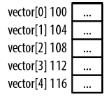
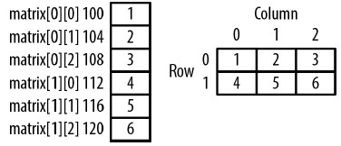
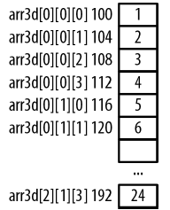

# Chatper 4 - 指標與陣列
### 陣列快速回顧
陣列是連續的同質 (homogeneous)元素的集合，能夠透過索引取得個別元素。連續表示陣列中所有的元素是記憶體中是緊接著不放，彼此之間不存在空隙，同值是指陣列中的元素型別都相同。

※ 陣列長度是固定不便，宣告陣列時就必須決定陣列的大小，指定太大的長度浪費記憶體空間，指定太小則限制能處理的元素個數。realloc函數與動態陣列提供處理需要改變大小的陣列技巧，藉由一些額外的程式碼，就能改變陣列的大小，使用適當的記憶體數量。

### 一維陣列
一維陣列是個線性資料結構，使用一個索引值存取其中的元素，以下是一個包含五個整數的陣列宣告:
```c
int vector[5];
```



陣列的內部表示方式中沒有任何與包含元述數量相關的資訊，陣列名稱只是參照到某個記憶體區塊，對陣列使用sizeof運算子會傳回配置給陣列的位元組數量，必須將陣列大小除以所包含元素的大小才能取得元素各數:
```c
printf("%d\n", sizeof(vector)/sizeof(int));  // 顯示5
```

一維陣列可以利用區塊型別命令初始化:
```c
int vector[5] = {1, 2, 3, 4, 5};
```

### 二維陣列
二維陣列使用列與行存取陣列中的元素:
```c
int matrix[2][3] = {{1,2,3},{4,5,6}};
```



二維陣列被視為陣列的陣列，也就是指用一個索引值存取陣列元素時，會得到指向對應列的指標，以下程式示範取得每一列的位址並顯示對應的大小:
```c
for (int i = 0; i < 2; i++) {
    printf("&matrix[%d]: %p sizeof(matrix[%d]): %d\n", i, &matrix[i], i, sizeof(matrix[i]));
}
```

輸出結果為:
```shell
&matrix[0]: 100 sizeof(matrix[0]): 12  # 由於每列包含3個4位元組的元素
&matrix[1]: 112 sizeof(matrix[1]): 12
```

### 多維陣列
多維陣列有二個或者更多維度，與二維陣列相同，需要更多組括號定義陣列的類型與大小，以下範例定義了喔個三維陣列:
```c
int arr3d[3][2][4] = {
    {{1, 2, 3, 4}, {5, 6, 7, 8}},
    {{9, 10, 11, 12}, {13, 14, 15, 16}},
    {{17, 18, 19, 20}, {21, 22, 23, 24}}
};
```



### 指標表示法與陣列