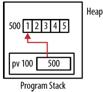
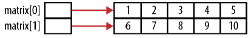
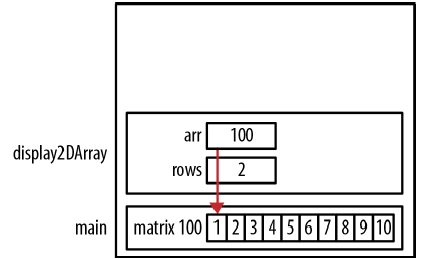
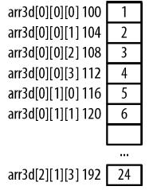
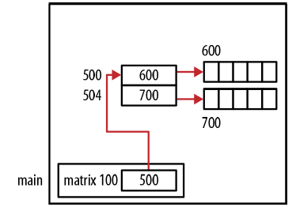
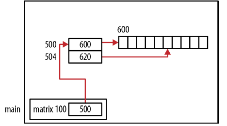
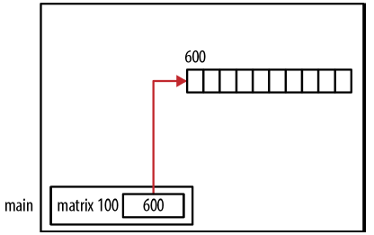

# Chatper 4 - 指標與陣列
### 陣列快速回顧
陣列是連續的同質 (homogeneous)元素的集合，能夠透過索引取得個別元素。連續表示陣列中所有的元素是記憶體中是緊接著不放，彼此之間不存在空隙，同值是指陣列中的元素型別都相同。

※ 陣列長度是固定不便，宣告陣列時就必須決定陣列的大小，指定太大的長度浪費記憶體空間，指定太小則限制能處理的元素個數。realloc函數與動態陣列提供處理需要改變大小的陣列技巧，藉由一些額外的程式碼，就能改變陣列的大小，使用適當的記憶體數量。

### 一維陣列
一維陣列是個線性資料結構，使用一個索引值存取其中的元素，以下是一個包含五個整數的陣列宣告:
```c
int vector[5];
```


陣列的內部表示方式中沒有任何與包含元述數量相關的資訊，陣列名稱只是參照到某個記憶體區塊，對陣列使用sizeof運算子會傳回配置給陣列的位元組數量，必須將陣列大小除以所包含元素的大小才能取得元素各數:
```c
printf("%d\n", sizeof(vector)/sizeof(int));  // 顯示5
```

一維陣列可以利用區塊型別命令初始化:
```c
int vector[5] = {1, 2, 3, 4, 5};
```

### 二維陣列
二維陣列使用列與行存取陣列中的元素:
```c
int matrix[2][3] = {{1,2,3},{4,5,6}};
```


二維陣列被視為陣列的陣列，也就是指用一個索引值存取陣列元素時，會得到指向對應列的指標，以下程式示範取得每一列的位址並顯示對應的大小:
```c
for (int i = 0; i < 2; i++) {
    printf("&matrix[%d]: %p sizeof(matrix[%d]): %d\n", i, &matrix[i], i, sizeof(matrix[i]));
}
```

輸出結果為:
```shell
&matrix[0]: 100 sizeof(matrix[0]): 12  # 由於每列包含3個4位元組的元素
&matrix[1]: 112 sizeof(matrix[1]): 12
```

### 多維陣列
多維陣列有二個或者更多維度，與二維陣列相同，需要更多組括號定義陣列的類型與大小，以下範例定義了喔個三維陣列:
```c
int arr3d[3][2][4] = {
    {{1, 2, 3, 4}, {5, 6, 7, 8}},
    {{9, 10, 11, 12}, {13, 14, 15, 16}},
    {{17, 18, 19, 20}, {21, 22, 23, 24}}
};
```


### 指標表示法與陣列
指標在處理陣列時十分有用，能夠與現有陣列一同使用或是從堆積配置記憶體，再將配置的記憶體視為陣列使用。陣列表示法與指標表示法在一定程度上能夠互換使用，然而兩者並非完全相同。

單純使用陣列名稱會傳回陣列的位址，並指派給指標:
```c
int vector[5] = {1, 2, 3, 4, 5};
int *pv = vector;
```

pv變數指向陣列中第一個元素的指標而非陣列本身，當指派給數值給pv時，指派的是陣列第一個元素的位址。

能夠只用陣列名稱或是透過取址運算子取得陣列第一個元素的位址，以下兩行程式碼有相同的作用，都會傳回vector的位址:
```c
printf("%p\n",vector);
printf("%p\n",&vector[0]);  // 取址運算子的寫法較為複雜但也較明確
```

有時候會使用&vector取得陣列位址，這與其他表示法不同，這種表示法會傳回整個陣列的指標，另外兩種表示法取得的是指向整數的指標。

指標也可以使用索引值，pv[i]表示式予以下指令等價:
```c
*(pv + i)
```

pv指標是記憶體區塊的位址，小括號會取得pv中的位址，再透過指標運算加上索引i的值，所得出的位址經由解參考運算取得其中數值。

指標加上整數會將位址增加整數乘上所指向資料型別的大小，同樣地，如果將陣列名稱加上整數，以下兩者運算有相同效果:
```c
*(pv + i)
*(vector + i)
```

|數值|等效運算|||
|-|-|-|-|
|92|&vector[-2]|vector - 2|&pv[-2]|pv - 2|
|100|vector|vector+0|&pv[0]|pv|
|100|&vector[0]|vector+0|&pv[0]|pv|
|104|&vector[1]|vector + 1|&pv[1]|pv + 1|
|140|&vector[10]|vector + 10|&pv[10]|pv + 10|


陣列表示法可以視為「位移與解參考」運算，vector[2]表示式代表從vector開始，也就是一個指向陣列開頭的指標向右位移兩個位置，然而再解參考位址取得其中的數值。

以下示範了使用指標實作向量乘上常量運算，將輸入的數值與向量中的每個元素相乘:
```c
pv = vector;
int value = 3;
for(int i=0; i<5; i++) {
    *pv++ *= value;
}
```

### 陣列與指標的差異
使用陣列與使用指向陣列指標間有幾個不同的地方:
```c
int vector[5] = {1, 2, 3, 4, 5};
int *pv = vector;
```

vector[i]產生的機器碼與*(vector+i)產生的機器碼不同，vector[i]產生的機器碼會從vector開始，移動i個位置，再使用其內容；*(vector+i)產生的機器碼則會從位置vector開始，將位址加上i，然後使用該位址的內容。雖然結果相同，但產生的機器碼不同。

sizeof運算子對陣列與指向陣列指標會產生不同的結果，對vector執行sizeof運算會得到20，也就是配置給陣列的記憶體數量。對pv使用sizeof運算子則傳回4，指標能夠透過指派新值指向記憶體不同的位置。

```c
pv = pv + 1;
vector = vector + 1;  // 語法錯誤
```

無法修改vector變數，只能修改陣列內容，然而，vector+1運算並不會有任何問題:
```c
pv = vector + 1;
```

### 使用malloc建立一維陣列
如果是從堆積配置記憶體指派給指標，就可以對指標使用陣列索引表示法，將記憶體視為陣列:
```c
int *pv = (int*) malloc(5 * sizeof(int));
for(int i=0; i<5; i++) {
    pv[i] = i+1;
}
```

也可以用如下的指標表示法，然而，陣列表示法看起來表較清楚:
```c
for(int i=0; i<5; i++) {
    *(pv+i) = i+1;
}
```



這個技巧將配置的記憶體區塊視為陣列，大小在執行期間決定，然而，切記不使用資料時要釋放記憶體。

※ 在之前的範例中使用*(pv+i)而非*pv+i，因為解參考比加法優先，第二個式子會先解參考指標，得到指標參照位址的數值，再將這個整數值加上i。此外，如果使用這個表示式作為lvalue，編譯器會發出錯誤訊息。因此，需要先強制執行加法，再作解參考院算，才能夠得到預期的數值。

### 使用realloc函數改變陣列大小
使用realloc函數能夠改變由malloc所建立的陣列大小。為了示範realloc函數，需要時做從標準輸入讀取字元，將讀取的字元指派至緩衝區的函數。緩衝區包含代表輸入結束的return字元外的所有字元，由於無法在事前知道使用者會輸入多少字元，無法決定緩衝區正確的大小，因此使用realloc函數讓緩衝區以固定大小成長。
```c
char* getLine(void) {
    const size_t sizeIncrement = 10;
    char* buffer = malloc(sizeIncrement);
    char* currentPosition = buffer;
    size_t maximumLength = sizeIncrement;
    size_t length = 0;
    int character;
    if(currentPosition == NULL) { return NULL; }
    while(1) {
        character = fgetc(stdin);
        if(character == '\n') { break; }
        if(++length >= maximumLength) {
            char *newBuffer = realloc(buffer, maximumLength += sizeIncrement);
            if(newBuffer == NULL) {
                free(buffer);
            return NULL;
            }
            currentPosition = newBuffer + (currentPosition - buffer);
            buffer = newBuffer;
        }
        *currentPosition++ = character;
    }
    *currentPosition = '\0';
    return buffer;
}
```

在getLine函數中有以下變數:
|變數名稱|功用|
|-|-|
|sizeIncrement|緩衝區初始大小以及每次成長的大小|
|buffer|指向讀取字元的指標|
|currentPosition|指向緩衝區中下個字元存放位置的指標|
|maximumLength|緩衝區終能安全存放的最大字元數|
|length|已讀取的字元數|
|character|目前讀入的字元|

緩衝區一開始建立時的大小是sizeIncrement，如果malloc函數無法配置足夠的記憶體，第一個if命令就會讓函數傳回NULL結束。接著進入第一個無窮迴圈，每次處理一個字元，離開迴圈時會在buffer的結尾加上字元的終止字元NULL，並傳回位址。

在while迴圈中會毒入第一個字元，如果是換行字元，就會離開迴圈，接著，利用if命令判斷是否超過buffer的容許大小，未超過容許大小就會將讀入的字元加在緩衝區最後的位置。

如果達到緩衝區空間的大小，使用realloc函數建立新的記憶體區塊會比園區塊增加sizeIncrement位元組的空間，如果無法配置新區塊則是放原有緩衝區，強制結束函數傳回NULL。否則，調整currentPosition到新緩衝區中適當的位置，並將buffer變數指向新配置的緩衝區。realloc函數不一定會將記憶體配置在原來的位置，因此必須使用函數傳回的指標作為新的、調整過大小的記憶體區塊。

newBuffer變數持有新配置的記憶體區塊位址，為了處理realloc無法配置記憶體的情況，必須使用獨立的變數，而非重複使用buffer變數，才能夠偵測與處理無法配置記憶體的情況。

因為realloc函數會將原記憶體區塊的資料複製到新的區塊的位置，並釋放掉原來的區塊，因此不需要再釋放舊有的緩衝區。如果程式中試著釋放buffer，通常會造成應用程式終止，因為程式重複釋放相同的記憶體區塊。

下圖是getLine函數接受「Once upon a time there was a giant pumpkin」的記憶體配置情況，圖中緩衝的四個方框代表緩衝區況展了四次。


realloc函數也可以用來減少指標使用的記憶體空間，接下來的trim函數會移除字串開頭的空間字元。
```c
char* trim(char* phrase) {
    char* old = phrase;
    char* new = phrase;
    while(*old == ' ') {
        old++;
    }
    while(*old) {
        *(new++) = *(old++);
    }
    *new = 0;
    return (char*) realloc(phrase,strlen(phrase)+1);
}
int main() {
    char* buffer = (char*)malloc(strlen(" cat")+1);
    strcpy(buffer," cat");
    printf("%s\n",trim(buffer));
}
```

第一個while迴圈使用old變數略過開頭所有的空白字元，第二個while迴圈將剩餘的字元複製到字串的開頭，迴圈會持續執行遇到字串的終止字元，再使用realloc根據新的字串長度重新配置記憶體。

下圖顯示了對原始字串「  cat」使用這個函數後的記憶體配置情況，以灰底標記的記憶體是原先的記憶體，不該再被存取。


### 傳遞一維陣列
當一維陣列傳入函數時，陣列位址以傳值的方式傳入，能讓資訊傳送更有效率，不需要為了傳送整個陣列的資料，在堆疊配置放置陣列內容的記憶體。

```c
void displayArray(int arr[], int size) {
    for (int i = 0; i < size; i++) {
        printf("%d\n", arr[i]);
    }
}

int vector[5] = {1, 2, 3, 4, 5};
displayArray(vector, 5);
```

執行時會依序輸出1到5的數字，程式將5傳入函數提供陣列大小資訊，也可以傳入任何整數，函數會根據輸入的大小輸出對應的元素數量，並不是檢查提供的大小是否正確，如果試著存取陣列邊界之外的記憶體可能會造成程式終止。


※ 以下是使用sizeof運算子判斷陣列元素個數時常見的錯誤，在這個例子中，會變成傳入20作為陣列大小:
```c
displayArray(arr, sizeof(arr));
```

宣告函數的陣列參數時並不一定需要使用中括號表示法，也可以如下列程式使用指標表示法:
```c
void displayArray(int* arr, int size) {
    for (int i = 0; i < size; i++) {
        printf("%d\n", arr[i]);
    }
}
```

函數內部依然能夠使用陣列表示法，依個人喜好，也可以在函數內使用指標表示法:
```c
void displayArray(int* arr, int size) {
    for (int i = 0; i < size; i++) {
        printf("%d\n", *(arr+i));
    }
}
```

如果函數宣告時使用陣列表示法，仍然可以在函數內部使用指標表示法:
```c
void displayArray(int arr[], int size) {
    for (int i = 0; i < size; i++) {
        printf("%d\n", *(arr+i));
    }
}
```

### 使用元素為指標的一維陣列
以下程式宣告了一個整數指標形成的陣列，並配置陣列中每個元素的記憶體，初始化為陣列的索引值:
```c
int* arr[5];
for(int i=0; i<5; i++) {
    arr[i] = (int*)malloc(sizeof(int));
    *arr[i] = i;
}
```

顯示這個陣列時，會印出0到4，程式中使用arr[i]參照到指標，並使用\*arr[i]將數值指派到指標指到的位址。不要被陣列表示法混淆，因為arr宣告為指標的陣列，arr[i]會傳回一個位址，當使用\*arr[i]解參考指標時，就會得到該位址的內容。

迴圈內容也可以用指標表示法寫成以下等價的程式:
```c
*(arr+i) = (int*)malloc(sizeof(int));
**(arr+i) = i;
```

(arr+i)表示式代表陣列第i個元素的位址，因為要修改這個位址的內容，所以使用*(arr+i)，配置的記憶體位址會被指派到這個位置。第二行程式中再次使用這個式子會傳回之前所配置記憶體的位址，再指派變數i的數值作為該位址的數值。


|Expression|Value|
|-|-|
|*arr[0]|0|
|**arr|0|
|**(arr+1)|1|
|arr[0][0]|0|
|arr[3][0]|3|

### 指標與多維陣列
多維陣列中的部分能夠視為子陣列，例如，二維陣列中的每個列都能視為獨立的一維陣列:
```c
int matrix[2][5] = {{1,2,3,4,5},{6,7,8,9,10}};
```

以下程式顯示每個元素的位址及其中的數值:
```c
for(int i=0; i<2; i++) {
    for(int j=0; j<5; j++) {
        printf("matrix[%d][%d] Address: %p Value: %d\n", i, j, &matrix[i][j], matrix[i][j]);
    }
}
```

輸出結果:
```shell
matrix[0][0] Address: 100 Value: 1
matrix[0][1] Address: 104 Value: 2
matrix[0][2] Address: 108 Value: 3
matrix[0][3] Address: 112 Value: 4
matrix[0][4] Address: 116 Value: 5
matrix[1][0] Address: 120 Value: 6
matrix[1][1] Address: 124 Value: 7
matrix[1][2] Address: 128 Value: 8
matrix[1][3] Address: 132 Value: 9
matrix[1][4] Address: 136 Value: 10
```

陣列主要是以列為主的方式儲存，也就是先依序儲存第一列的內容，接著再存放在第二列。


可以使用如下的方式以指標宣告陣列:
```c
int (*pmatrix)[5] = matrix;
```

(*pmatrix)表示式宣告了一個指向陣列的指標，結合宣告的其他部分，pmatrix定義為指向二維整數陣列的指標，每列有五個元素。如果去掉小括號，就會變成宣告一個五個元素的陣列，各元素是指向整數的指標。

如果想要用指標表示法存取第二個元素2，可以用以下的方式:
```c
printf("%p\n", matrix);
printf("%p\n", matrix + 1);
```

輸出結果:
```shell
100
120
```

matrix+1傳回的位址的位移與陣列起始位置的差距不是4，相反地，是第一列的大小，20個位元組。
```c
printf("%d\n",sizeof(matrix[0]));  // 顯示20
```

要存取子陣列中的第二個元素，必須在陣列的第一列位址加上一: *(matrix[0] + 1)，matrix[0]會傳回第一列的第一個元素的位址，這是個整數陣列的位址，加一只會加上一個整數的大小，因此可以得到第二個元素:
```c
printf("%p %d\n", matrix[0] + 1, *(matrix[0] + 1));  // 輸出會是104和2
```



### 傳入多維陣列
將多維陣列傳入函數很容易造成困擾，特別是使用指標表示法時。當傳入多維陣列，便需要決定在函數圓形中該使用陣列表示法或指標表示法；另一個需要考慮的要點是如何表達陣列的形狀，也就是陣列的維度數量以及各維度的大小。

例如傳入matrix陣列時可以使用以下兩種宣告方式:
```c
// Method 1
void display2DArray(int arr[][5], int rows) {
    ...
}

// Method 2
void display2DArray(int (*arr)[5], int rows) {
    ...
}
```

兩種方式都指定了行數，因為編譯器需要知道每列的元素個數。第一種方式中，arr[]隱含的意義是宣告了指向指標的陣列，第二種方式(*arr)則明確地將變數宣告為指標。

※ 以下宣告無法如預期的方式運作:
```c
void display2DArray(int *arr[5], int rows) {
    ...
}
```

雖然不會產生語法錯誤，但傳入的陣列會被視為有五個整數指標元素的陣列。

以下是函數的實作以及使用方式:
```c
void display2DArray(int arr[][5], int rows) {
    for (int i = 0; i<rows; i++) {
        for (int j = 0; j<5; j++) {
            printf("%d", arr[i][j]);
        }
        printf("\n");
    }
}

void main() {
    int matrix[2][5] = {
        {1, 2, 3, 4, 5},
        {6, 7, 8, 9, 10}
    };
    display2DArray(matrix, 2);
}
```

函數並沒有配置陣列使用的記憶體，指傳入了陣列位址。



有時候可能遇到如以下的函數宣告，接受一個指標以及行、列的數量:
```c
void display2DArrayUnknownSize(int *arr, int rows, int cols) {
    for(int i=0; i<rows; i++) {
        for(int j=0; j<cols; j++) {
            printf("%d ", *(arr + (i*cols) + j));
        }
        printf("\n");
    }
}
```

printf命令將arr加上之前每列的元素數量(i*cols)，再加上j得到目標元素的位址，使用以下的方式呼叫這個函數:
```c
display2DArrayUnknownSize(&matrix[0][0], 2, 5);
```

在函數內部無法使用以下的陣列索引表示法取得個別元素:
```c
printf("%d ", arr[i][j]);
```

因為指標並非宣告為二維陣列，沒有辦法以這種方式取得。索引值會解釋成陣列中與第一個元素的位址差，只能夠使用一個索引值，不能夠使用兩個索引值的原因在於編譯器不知道個別維度的大小:
```c
printf("%d ", (arr+i)[j]);
```

當傳入超過二維的陣列時，必須指定第一維度以外的各維度大小，以下是個顯示三維陣列內容的函數，宣告中指定了後兩個維度的大小:
```c
void display3DArray(int (*arr)[2][4], int rows) {
    for(int i=0; i<rows; i++) {
        for(int j=0; j<2; j++) {
            printf("{");
            for(int k=0; k<4; k++) {
                printf("%d ", arr[i][j][k]);
            }
            printf("}");
        }
        printf("\n");
    }
}
```

以下程式示範了函數呼叫方式:
```c
int arr3d[3][2][4] = {
    {{1, 2, 3, 4}, {5, 6, 7, 8}},
    {{9, 10, 11, 12}, {13, 14, 15, 16}},
    {{17, 18, 19, 20}, {21, 22, 23, 24}}
};

display3DArray(arr3d, 3);
```

輸出結果:
```shell
{1 2 3 4 }{5 6 7 8 }
{9 10 11 12 }{13 14 15 16 }
{17 18 19 20 }{21 22 23 24 }
```



### 動態配置二維陣列
動態配置二維陣列的記憶體時需要考慮幾個問題，包含:
* 陣列中的元素位置是否需要連續
* 是否為不規則陣列

使用以下方式宣告的二維陣列記憶體是以連續的方式配置:
```c
int matrix[2][5] = {{1,2,3,4,5},{6,7,8,9,10}};
```

當使用如malloc等函數建立二維陣列時，有許多不同配置記憶體的方式。二維陣列被視為陣列的陣列，不會假設內部的陣列彼此互相連續，使用陣列表示法時，程式語言會自動處理陣列本身的不連續的特質。

※ 陣列內容是否連續會影響其他運算，例如複製記憶體區塊，如果記憶體不連續，可能會需要複製多次。

### 配置可能不連續的記憶體
以下示範了一種配置二維陣列記憶體的方式，其中子陣列的記憶體並非連續:
```c
int rows = 2;
int columns = 5;

int **matrix = (int **) malloc(rows * sizeof(int *));

for (int i = 0; i < rows; i++) {
    matrix[i] = (int *) malloc(columns * sizeof(int));
}
```

由於使用個別的malloc呼叫，配置的記憶體可能不會連續。



實際配置的記憶體位置是由堆積管理員以及堆積狀態而定，也有可能配置到連續的記憶體。

### 配置連續記憶體
以下介紹兩種以連續記體配置二維陣列的方式，第一種技巧先配置外部陣列，再一次配置所有元素所需要的記憶體；第二種方式則是一次配置所需要的記憶體。

下列程式示範第一種作法:
```c
int rows = 2;
int columns = 5;

// 第一個malloc配置一個整數指標陣列，每個元素持有一列的資料
int **matrix = (int **) malloc(rows * sizeof(int *));

// 第二個malloc在位址600的位置配置了陣列所有元素所需要的記憶體空間
matrix[0] = (int *) malloc(rows * columns * sizeof(int));
for (int i = 1; i < rows; i++)
    matrix[i] = matrix[0] + i * columns;
```



一般而言，第一個陣列配置的記憶體會與陣列內容的記憶體分開，內容部分會位於連續的記憶體上。

第二種做法如下，一次配置陣列所需要的所有記憶體:
```c
// 呼叫一次malloc配置連續記憶體 
int *matrix = (int *)malloc(rows * columns * sizeof(int));
```



後續程式使用陣列時，不能使用多維陣列索引的方式，必須手工計算在陣列中的位置，如同以下程式碼的示範，每個元素都初始化為索引值的乘積:
```c
for (int i = 0; i < rows; i++) {
    for (int j = 0; j < columns; j++) {
        *(matrix + (i*columns) + j) = i*j;
    }
}
```

無法使用陣列索引值的原因在於失去了陣列形狀的資訊，編譯器需要有這些資訊才能夠使用陣列索引。

### 不規則陣列與指標
