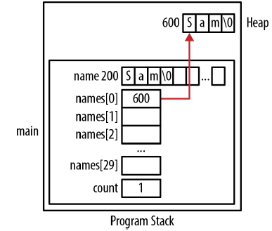
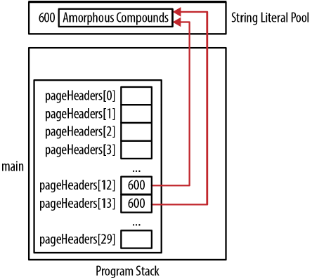
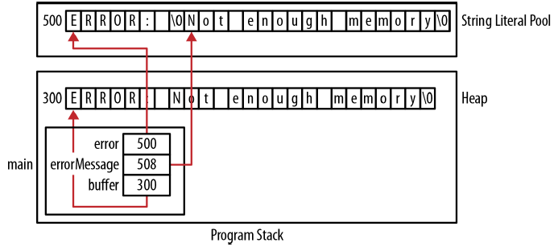
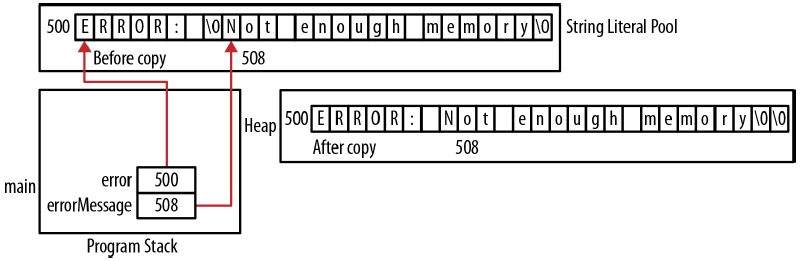
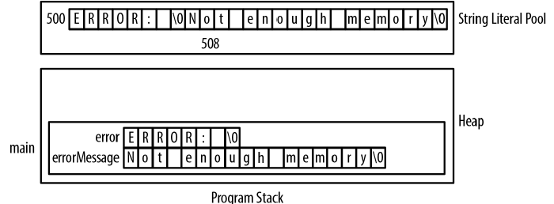
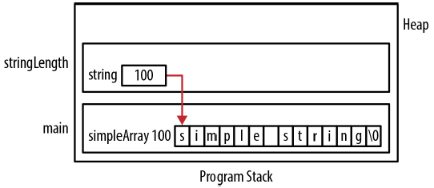

# Chatper 5 - 指標與字串
### 字串的基礎
字串是以ASCII NUL字元結束的字元序列，ASCII的NU字元以\0表示，字串通常儲存在陣列或是配置在堆積的記憶體，並非所有字元都是字串，字元陣列可能不包含NUL字元。char型別的陣列可能用於表示較小的整數型別，如布林值，以節省應用程式的記憶體空間。

C語言中有兩種字串型別:
* 位元組字串 (Byte string)
    - 由char資料型別組成的序列
* 寬字元字串 (Wide string)
    - 由wchar_t資料型別組成的序列

wchar_t資料型別用於寬字元，可能是16或是32字元。這兩種字串都以NUL字元結尾，位元組字串函數一般宣告在string.h檔案中，寬字元字串函數宣告於wchar.h檔案。

※ 切記NULL與NUL並不相同，NULL是特殊指標，一般定義為((void*)0)，NUL則是個定義為'\0'的字元，兩者不該交互使用。

字元常量是以單引號刮起來的字元序列，一般來說只包含一個字元，但也可以包含多個字元，例如跳脫字元:
```c
printf("%d\n",sizeof(char));  // 顯示1
printf("%d\n",sizeof('a'));   // 顯示4
```

### 字串宣告
字串宣告有三種不同的方式: 常量、字元陣列以及字元指標。字串常量是以雙引號刮起來的字元序列，通常用於初始化字串變數。

以下是一個字元陣列，程式宣告了最多能夠存放31個字元的header陣列，由於字串須以NUL結尾，宣告為32個字元大小的陣列實際上只能存放31個字元的字串:
```c
char header[32];
```

以下是個字元指標，還沒有初始化也尚未參照到任何字串，這個時候還沒有指定字串的長度與位置:
```c
char *header;
```

### 字串常量池
定義字串常量時，字串常量常常會被指派到字串常量池 (literal pool)中，這個記憶體區域存放字串組成的字元序列。多次使用相同的常量，一般只會有一份實際的副本存放在字串常量池 (string literal pool)中，這能夠減少應用程式需要的空間。

※ GCC使用 -fwritable-strings選項關閉string pooling。


字串常量經常被配置在唯讀記憶體 (read-only memory)中，使得常量不論使用於全域、靜態或是區域都是不可變。從這個角度而言，字串常量並沒有範圍。

### 當字串常量不是常數
大多數編譯器都將字串常量視為常數，無法修改字串常量的內容，然而，某些編譯器，例如GCC，夠修改字串常量的內容，例如以下範例:
```c
char *tabHeader = "Sound";
*tabHeader = 'L';
printf("%s\n",tabHeader);  // 顯示Lound
```

程式會將常量修改為Lound，一般來說，這並不是預期行為，應該盡量避免，用以下的方式將變數宣告為常數能夠部份解決這個問題:
```c
const char *tabHeader = "Sound";
```

### 字串初始化
字串陣列能夠以初始化運算子初始化，以下範例中，header陣列以字串常量中的字元初始化:
```c
char header[] = "Media Player";
```

由於"Media Player"字串常量有12個字元長，總共需要13個位元組來表示整個常量。陣列會配置13個位元組已持有字串內容，初始化會初始內容字元以及結尾的NUL字元到陣列中。


陣列可以使用strcpy函數初始化，以下程式將字串常量複製到陣列:
```c
char header[13];
strcpy(header,"Media Player");
```

較繁瑣的方式是如以下程式逐一指派個別字元:
```c
header[0] = 'M';
header[1] = 'e';
    ...
header[12] = '\0';
```

※ 以下的指派命令不合法，無法將字串常量指派給陣列名稱:
```c
char header2[];
header2 = "Media Player";
```

### 初始化字元指標
使用動態記憶體配置有較大的彈性，也可以讓記憶體存活較長的時間:
```c
char *header;
```

一般用來初始化字串的方式利用了malloc與strcpy函數配置記憶體並將常量複製到字串:
```c
char *header = (char*) malloc(strlen("Media Player")+1);
strcpy(header,"Media Player");
```


上述範例使用malloc函數時，透過strlen函數與字串常量計算出字串的長度，也可以像以下的程式直接指定字串長度:
```c
char *header = (char*) malloc(13);
```

※ 在計算malloc函數使用的字串長度時:
* 總是加上一個供NUL終止字元使用
* 不要使用sizeof運算子，應該使用strlen函數取得原有字串的長度，sizeof運算子會傳回陣列或指標的大小，而非字串長度

如果不使用字串常量與strcpy函數初始化字串，也可以使用以下方式:
```c
*(header + 0) = 'M';
*(header + 1) = 'e';
    ...
*(header + 12) = '\0';
```

可以直接將字串常量的位址指派給字元指標，如以下程式，這並不會建立新的字串:
```c
char *header = "Media Player";
```


※ 不能以字元常量初始化字元指標，字元常量的型別為int，編譯器會解讀成將整數指派給字元指標，這種作法會在解參考指標時造成應用程式終止:
```c
char* prefix = '+';  // 不合法
```

以下是使用malloc函數的正確做法:
```c
prefix = (char*)malloc(2);
*prefix = '+';
*(prefix+1) = 0;
```

### 透過標準輸入初始化字串
字串也可以透過外部資料來初始化，例如標準輸入，從標準輸入讀取字串可能發生初始化錯誤，例如以下程式碼:
```c
char *command;
printf("Enter a Command: ");
scanf("%s", command);  // command變數使用前沒有指派可用記憶體
```

要解決此問題，應該先為指標配置記憶體或使用固定大小的陣列而非指標。

### 字串放置總結
字串可能配置在幾個不同的地方:
```c
char* globalHeader = "Chapter";
char globalArrayHeader[] = "Chapter";

void displayHeader() {
    static char* staticHeader = "Chapter";
    char* localHeader = "Chapter";
    static char staticArrayHeader[] = "Chapter";
    char localArrayHeader[] = "Chapter";
    char* heapHeader = (char*)malloc(strlen("Chapter")+1);
    strcpy(heapHeader,"Chapter");
}
```


知道字串所在的位置有助於理解程式運作與使用指標存取字串，字串所在的位置決定了字串存續的時間以及應用程式中有能力存取字串的部分。例如，配置在全域記憶體的字串會一直存在。而且能被多個函數存取；靜態字串能夠持續存在卻只能在所定義的函數之內存取；配置在堆積的字串能夠存續到釋放之前，也能夠被多個函數使用，理解這些有助於在撰寫程式時做出更正確的決定。

### 比較字串
strcmp函數是比較字串的標準做法，原型如下:
```c
int strcmp(const char *s1, const char *s2);
```

比較的兩個字串都是以常數字元指標的方式傳入函數，使用者不需要擔心傳入的字串會受到修改，函數可能傳回三種數:
* 負值
    - s1位於s2之前 (以字母順序)
* 零
    - 兩個字串相等
* 正值
    - s1位於s2之後 (以字母順序)

傳回正負值對於將字串依字母順序排序十分有用，以下是使用函數檢測是否相等:
```c
char command[16];

printf("Enter a Command: ");
scanf("%s", command);
if (strcmp(command, "Quit") == 0) {
    printf("The command was Quit");
} else {
    printf("The command was not Quit");
}
```


有幾種錯誤的字串比較方式，第一種是使用指派運算子比較兩個字串:
```c
char command[16];

printf("Enter a Command: ");
scanf("%s",command);

// 這會產生型別不符的語法錯誤訊息，字串的位址無法指派給陣列名稱
if(command = "Quit") {  
    ...
}
```

第二種錯誤是使用相等運算子
```c
char command[16];

printf("Enter a Command: ");
scanf("%s",command);

// 比較結果永遠是否定的，因為比較的是command的位址300，與字串常量的位址600
if(command == "Quit") {  
    ...
}
```

### 複製字串
複製字串十分常見，一般是使用strcpy函數，函數原型如下:
```c
char* strcpy(char *s1, const char *s2);
```

常見的應用是讀取一連串的字串，再將字串分別儲存在陣列中以減少記憶體的使用量。要達成這個要求需要建立一個能儲存使用者最常輸入字串的陣列，將使用者輸入的字串先讀到陣列中，一旦成功的讀取字串，再根據字串長度配置正確的記憶體，流程如下:
1. 使用大的字元陣列讀入字串
2. 使用malloc配置正確數量的記憶體
3. 使用strcpy將字串複製到動態配置的記憶體

以下程式碼示範了上述流程，names陣列持有每個讀入姓名的指標，count變數標記了下個可使用的陣列元素，names陣列則用於存放毒入的字串，每個讀取姓名時都會重複使用。malloc函數依據每次讀入的字串長度配置足夠的記憶體，並將指標指派到names陣列中下個可用元素，接著再將name的內容複製到配置的記憶體中:
```c
char name[32];
char *names[30];
size_t count = 0;

printf("Enter a name: ");
scanf("%s",name);
names[count] = (char*)malloc(strlen(name)+1);
strcpy(names[count],name);
count++;
```

可以用迴圈重複這個過程，每個循環遞增count值。



兩個指標可以參考到相同的字串，當兩個指標參考到同一字串時稱為別名 (aliasing)。雖然這不一定會造成問題，但必須要知道將一個指標指派給另一個指標並不會複製字串，只是複製字串的位址而已。

以下程式讓兩個指標參照到相同的字串常量，複製的是指標而非字串:
```c
char *pageHeaders[300];
pageHeaders[12] = "Amorphous Compounds";
pageHeaders[13] = pageHeaders[12];
```



### 連結字串
字串連結會合併兩個字串，strcat常用於這項操作，這個函數接受兩個要連結的字串，傳回一個指向連結後結果的指標，函數原型為:
```c
char *strcat(char *s1, const char *s2);
```

函數將第二個字串連接再第一個字串的尾端，第二個字串以常數字元指標的方式傳入，函數並不會配置記憶體，這表示第一個參數必須擁有足夠放置連結後結果的空間，否則就會寫入字串結尾之後，造成不可預期的行為。函數傳回的位址與第一個參數的位址相同，這樣的行為在某些情形十分方便，例如將函數作為printf函數的參數。

以下結合兩個錯誤訊息字串示範函數的使用，第一個字串是前綴，第二個字串是明確的錯誤訊息。程式中首先需要配置足夠放置兩個字串的緩衝區，再將第一個字串複製到緩衝區，最後將第二個字串連結再緩衝區的尾端:
```c
char* error = "ERROR: ";
char* errorMessage = "Not enough memory";

// malloc函數的參數加上1以放置NUL
char* buffer = (char*)malloc(strlen(error)+strlen(errorMessage)+1);
strcpy(buffer,error);
strcat(buffer, errorMessage);

printf("%s\n", buffer);
printf("%s\n", error);
printf("%s\n", errorMessage);
```

輸出結果:
```shell
ERROR: Not enough memory
ERROR:
Not enough memory
```



如果沒有另行配置記憶體供連結後的字串使用，就會覆蓋第一個字串內容，如同以下沒有使用緩衝區的範例，同樣也假設兩個字串常量在記憶體中是緊鄰著存放:
```c
char* error = "ERROR: ";
char* errorMessage = "Not enough memory";

strcat(error, errorMessage);

printf("%s\n", error);
printf("%s\n", errorMessage);
```

輸出結果:
```shell
ERROR: Not enough memory
ot enough memory
```

errorMessage字串位置往左移了一個字元，因為連結字串的結果覆蓋了errorMessage的內容，由於常量「Not enough memory」的位置緊鄰第一個常量，第二個常量的內容會被覆蓋:



也可以使用陣列而非指標存放這些訊息，如以下程式:
```c
char error[] = "ERROR: ";
char errorMessage[] = "Not enough memory";
```

如果使用以下的方式呼叫strcpy將會造成語法錯誤，因為試著將由韓數傳回的指標指派給陣列的名稱，是不合法的操作:
```c
error = strcat(error, errorMessage);
```

移除指派命令讓程式變成以下的形式:
```c
strcat(error, errorMessage);
```

可能會造成記憶體存取問題，因為複製操作會負寫掉部分的堆疊框架，假設陣列是宣告在函數當中。不論字串來自於字串常量池或是堆疊框架，都不應該直接用於存放連結後的結果。切記為連結結果配置專用的記憶體。



另一個字串連結常見的錯誤是使用字元常量而非字串常量，以下範例將字串連結道路徑字串，能以預期的行為執行:
```c
char* path = "C:";
char* currentPath = (char*) malloc(strlen(path)+2);
currentPath = strcat(currentPath,"\\");
```

呼叫malloc時在字串長度加上2，因為需要空間供額外的字元與NUL字元，程式連結了單一字元與反斜線，第二個字串常量使用了跳脫字元。

如果使用字元常量，如以下程式，會造成執行期錯誤，因為第二個參數會被解讀成char的位址:
```c
currentPath = strcat(path,'\\');
```

### 傳入字串
根據字串宣告方式不同，將字串位址傳入函數也有幾種不同的方式。


下述範例，函數中利用小括號強制讓後遞增運算子先執行，移動指標的位置。由於後遞增運算子得的優權比解參考運算子還高，小括號並非絕對必要，但加上小括號能更明確的表明程式設計師的意圖。
```c
size_t stringLength(char* string) {
    size_t length = 0;
    while(*(string++)) {
        length++;
    }
    return length;
}
```

※ 字串實際上應該以常數字元指標的類型傳入。

先從以下的宣告開始:
```c
char simpleArray[] = "simple string";
char *simplePtr = (char*)malloc(strlen("simple string")+1);
strcpy(simplePtr, "simple string");
```

呼叫以指標為參述的函數時，只需要使用指標的名稱:
```c
printf("%d\n",stringLength(simplePtr));
```

以陣列呼叫時有三種選擇，第一個命令直接使用陣列名稱，會傳回陣列的位址；第二個命令明確地使用取指運算子，雖然程式可以執行，但實際傳入的是字元指標的指標而非字元指標，這會產生警告訊息；第三種作法對陣列的第一個元素使用取址運算子，雖然符合預期行為，但太過繁瑣:
```c
printf("%d\n",stringLength(simpleArray));
printf("%d\n",stringLength(&simpleArray));
printf("%d\n",stringLength(&simpleArray[0]));
```

