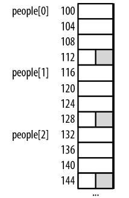
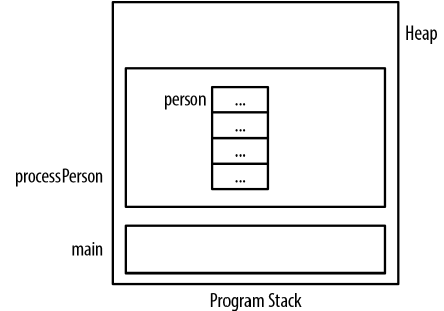
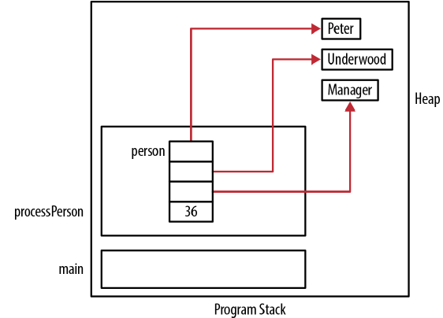
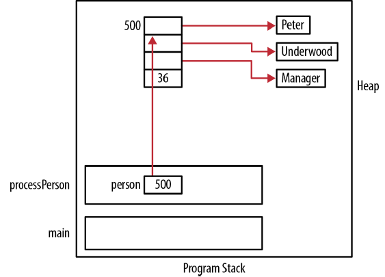

# Chatper 6 - 指標與結構
### 結構簡介
C語言的結構有幾種不同的宣告方式，在以下的宣告中，結構的名稱之前加上了底線以供識別，雖然不一定要如此，但這是常見的命名慣例:
```c
struct _person {
    char* firstName;
    char* lastName;
    char* title;
    unsigned int age;
};
```

結構宣告時通常會使用typedef關鍵字以簡化後續程式的使用，以下是同樣_person結構的例子:
```c
typedef struct _person {
    char* firstName;
    char* lastName;
    char* title;
    unsigned int age;
} Person;
```

人員 (person)的實體可宣告如下:
```c
Person person;
```

或是也可以宣告指向Person的指標，並配置所需的記憶體，如下:
```c
Person *ptrPerson;
ptrPerson = (Person*) malloc(sizeof(Person));
```

如果使用person這樣直接指派的宣告方式，可以使用點符號 (dot notation)存取結構中的欄位。以下程式中，指派了firstName與age欄位:
```c
Person person;
person.firstName = (char*)malloc(strlen("Emily")+1);
strcpy(person.firstName, "Emily");
person.age = 23;
```

然而，使用結構指標，就需要使用指向運算子 (point-to operator)，如以下程式:
```c
Person *ptrPerson;
ptrPerson = (Person*)malloc(sizeof(Person));
ptrPerson->firstName = (char*)malloc(strlen("Emily")+1);
strcpy(ptrPerson->firstName, "Emily");
ptrPerson->age = 23;
```

並不一定非得使用指向運算子不可，也可以解參考指標，再使用點符號，以下程式與上述程式執行了相同的指派操作:
```c
Person *ptrPerson;
ptrPerson = (Person*)malloc(sizeof(Person));
(*ptrPerson).firstName = (char*)malloc(strlen("Emily")+1);
strcpy((*ptrPerson).firstName, "Emily");
(*ptrPerson).age = 23;
```

### 結構的記憶體配置
配置結構使用的記憶體時，配置的記憶體至少是個欄位所需記憶體的加總，實際配置大小經常大於個欄位的加總，結構欄位間必須做邊界調整 (padding)，邊界調整的原因可能是特定資料型別必須依照特定的邊界放置。例如，短整數通常會切齊偶數位址放置，而整數則會以4的倍數的位址放置。

這些額外的記憶體配置造成了幾個影響:
* 指標運算時必須十分小心
* 結構的陣列在各元素間可能會有額外的記憶體

例如，先前介紹的Person結構配置在記憶體中會需要16個位元組，各欄位4個位元組。以下這個版本的Person用short表示age而非unsigned int，但仍然需要配置相同數量的記憶體，因為在結構尾端會做邊界調整，加上兩個位元組的記憶體:
```c
typedef struct _alternatePerson {
    char* firstName;
    char* lastName;
    char* title;
    short age;
} AlternatePerson;
```

下列程式中分別宣告了Person與AlternatePerson結構的實體，再分別顯示兩者的記憶體大小，同樣都是16位元組:
```c
Person person;
AlternatePerson otherPerson;
printf("%d\n",sizeof(Person));           // 顯示16
printf("%d\n",sizeof(AlternatePerson));  // 顯示16
```

假設使用以下的方式建立AlternatePerson的陣列，陣列元素間就會有邊界調整的空隙。圖中陰影的部分就是陣列元素間的空隙。



### 釋放結構的問題
配置結構的記憶體時，執行期系統並不會自動配置結構內部指標所需的記憶體，同樣地，釋放結構記憶體時，執行期系統也不會自動釋放指派給結構中指標的記憶體。
```c
typedef struct _person {
    char* firstName;
    char* lastName;
    char* title;
    uint age;
} Person;
```

當宣告這類型的變數，或是動態配置這類型的記憶體時，結構中的三個指標只是沒有意義的資料，然而，若是宣告為static變數，那麼結構成員就會被初始化為0 (指標則是初始化為NULL)。在以下的程式中，宣告了Person，記憶體配置如下圖，其中的三個點表示未初始化記憶體:
```c
void processPerson() {
    Person person;
        ...
}
```



在初始化結構時，必須指派給每個欄位的數值，結構中的指標欄位必須先從堆積配置記憶體，在指派各個指標:
```c
void initializePerson(Person *person, const char* fn, const char* ln, const char* title, uint age) {
    person->firstName = (char*) malloc(strlen(fn) + 1);
    strcpy(person->firstName, fn);
    person->lastName = (char*) malloc(strlen(ln) + 1);
    strcpy(person->lastName, ln);
    person->title = (char*) malloc(strlen(title) + 1);
    strcpy(person->title, title);
    person->age = age;
}
```

可以用以下方是使用這個函數:
```c
void processPerson() {
    Person person;
    initializePerson(&person, "Peter", "Underwood", "Manager", 36);
        ...
}
int main() {
    processPerson();
        ...
}
```



由於宣告在函數內部，當函數結束後person的記憶體也隨著被釋放，但動態配置的記憶體並不會被釋放，會持續佔據堆積。此時已失去記憶體位址，沒有辦法釋放記憶體，會造成記憶體洩漏。

處理完這個實體後，需要釋放記憶體，以下函數會釋放先前建立實體時配置的記憶體:
```c
void deallocatePerson(Person *person) {
    free(person->firstName);
    free(person->lastName);
    free(person->title);
}
```

這個函數必須在外部函數結束之前呼叫:
```c
void processPerson() {
    Person person;
    initializePerson(&person, "Peter", "Underwood", "Manager", 36);
        ...
    deallocatePerson(&person);
}
```

如果使用Person指標，需要記得使用以下方式釋放person:
```c
void processPerson() {
    Person *ptrPerson;
    ptrPerson = (Person*) malloc(sizeof(Person));
    initializePerson(ptrPerson, "Peter", "Underwood", "Manager", 36);
        ...
    deallocatePerson(ptrPerson);
    free(ptrPerson);
}
```

