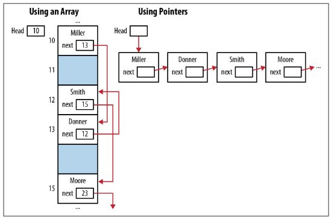
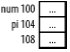

# Chatper 1 - 入門
## 指標與記憶體
### 記憶體類型:
1. 靜態 Static / 全域 Global
2. 自動 Automatic
3. 動態 Dynamic

|變數類型|範圍|生命週期|
|-|-|-|
|全域|整個檔案|應用程式的生命週期|
|靜態|宣告所在的函數|應用程式的生命週期|
|自動 (區域)|宣告所在的函數|函數執行期間|
|動態|視參考到的指標而定|直到釋放記憶體|

※ 指標變數存放的是記憶體位址，並不含任何能夠得知所參照記憶體資料型別所需的資訊

指標的用途:
1. 建立快速有效率的程式碼
2. 提供更方便解決問題的方法
3. 動態記憶體配置
4. 簡化表達式
5. 利用指標傳遞結構資料，避免傳遞大量資料所造成的負擔
6. 保護以參數傳入函數的資料



下述程式皆會印出n

```c
char *names[] = {"Miller","Jones","Anderson"};
printf("%c\n",*(*(names+1)+2));  // 難懂
printf("%c\n",names[1][2]);      // 易懂
```

指標可能引發的問題:
1. 存取陣列或其他資料結構時超出可用範圍
2. 在可用範圍之外參考自動變數
3. 在記憶體釋放後參考配置在堆積上的記憶體
4. 在配置記憶體前解參考指標

### 宣告指標
```c
int num;  // 整數
int *pi;  // 整數指標
```

